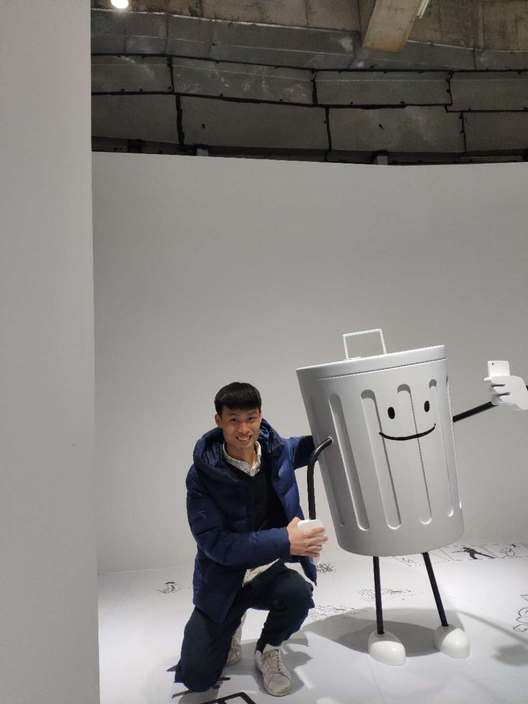

  2018年就要结束了，这一年起起伏伏，失去很多，也收获很多，想着马上要步入社会了，也该给自己做做总结了。
  
  2018年3月10号，和女孩分手了。很抱歉，还是不够成熟，自己的感情和生活处理的一团乱，还信誓旦旦的说要治好你的感情病，你还傻傻的相信我了。和你一起走的日子惭愧，有些地方伤害了到你。前两个礼拜短信联系，互相释怀了一切，美好的大三谢谢有你，一起的日子我很快乐。虽然不能再一起走下去了，但是希望你能早点遇见能治好你病的人。愿你一直坚持着热爱的动画，快乐的创作，愿一切顺利。
  
  2018年5月6号，ASC颁奖啦，初次入决赛，我们冲进了前八，紧随浙大，感谢所有的队友，大家都很努力。这算是大学做的最值得吹牛逼的事吧！还是感谢所有人的努力，一起在实验室睡觉的日子，一起抓狂跑程序，改论文的日志，比赛现场，现学现卖，突破难题。看过大家笑的最灿烂的样子，看过大家最认真努力的样子，哈哈，这就是青春最美的样子吧，谢谢有你们！
  
  2018年7月10号，入职北京OTC Intel实习，来到魔都，在英特尔开源技术中心遇到一位位身怀绝技的大佬。导师老杜，一大把年纪了，还对技术那么热爱追求，哈哈，这大概是技术人活成了最美的样子吧。佛系的老板，头像都是佛像，刚加微信的时候都担心是不是进入传销组织了 ⌇●﹏●⌇ ，不过后来发现，老板确实是老板，技术牛逼，淡泊，懂得生活，能管理。哈哈，我不是在拍马屁，大佬就是大佬，没必要太多修饰。一起吃饭的徐core-一个很热心的小胖哥，nova core程序员 绝对的武林高手；张core 认真的写着代码，却又特别文艺，哈哈，那个文艺旅行的公众号我存着呢，工位在旁边，只能经常骚扰你啦；冰哥，让人看上去就是大佬；还有欣然小姐姐，海龟大佬，写的代码都是FPGA在开源云上的实现， 惭愧惭愧，虽然说的话不多，但是可以感觉到是一个认真，努力，真诚的女孩。这两个月，谢谢有你们，然我对未来有了一定的想法，真正的技术人，不浮躁，安心写代码，执着追求完美的技术。
  
  2018年9月19日，回到学校，确定破格保研没有保到的消息，做点研究的梦想还是破灭了。迷茫了两个礼拜，秋招过了一半了，开始投简历。
  
 2018年9月28日，来到杭州。准备孤注一掷，拼秋招，滴滴分布式NoSQL数据库团队，在这里的都是大佬，虽然经常加班，但是这段时间进步很快，希望自己能一点点慢慢沉淀吧。
 
 2018年11月23日，签了三方，也算是确定了下一步的路了，为自己加油打CALL。
 
 回看过去这一年，还是执着的追求的技术，虽然路走的那么不确定，但也许这就是生活吧。感情上还是问题一大堆，希望自己慢慢成长，用心去面对感受吧，谢谢每一个用心一起走过的人，青春里没有对错，我们都在见证对方最美最可爱的样子。时光漫长，不虚度，不悔恨，过好每一天。
 

