**磁盘式数据库存储架构**

- DBMS假设数据库主要存储在非易失性设备上
- DBMS的组建管理数据在非易失性存储和易失性存储之间的数据移动

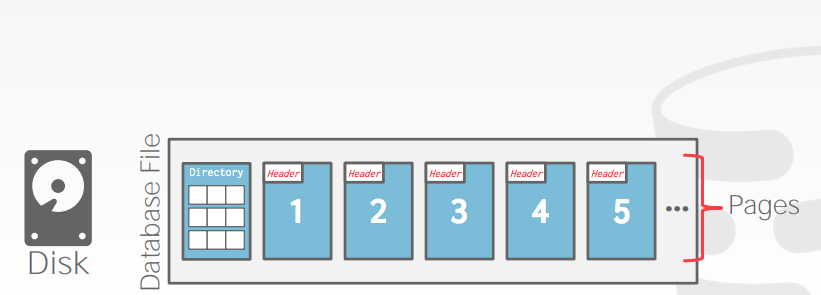

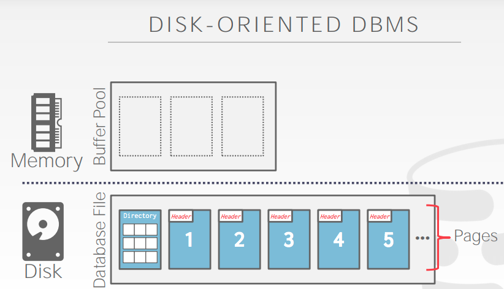

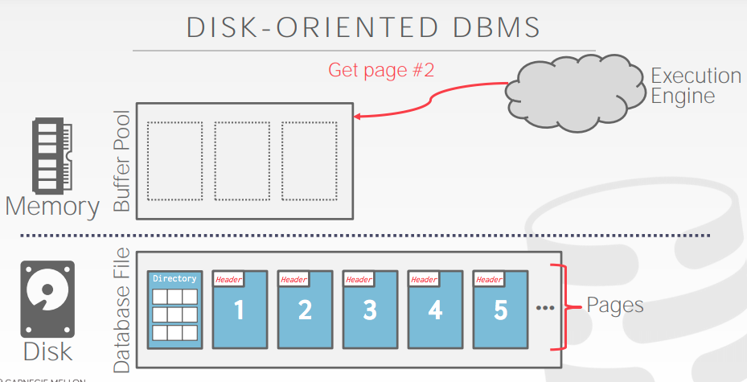

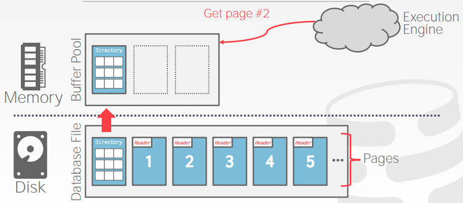

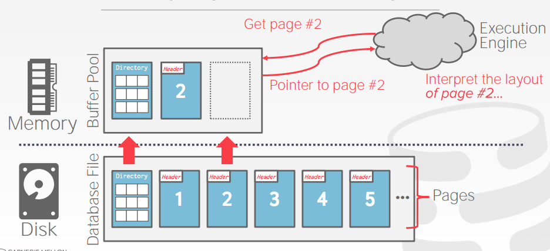

**元组存储**

- 元组本质上是一个字节序列，DBMS的工作就是解释这些字节属性类型和值
- DBMS的catalogs包含了系统用来描述系统表的信息，以及描述元组的布局

**数据表示**

- INTEGER/BIGINT/SMALLINT/TINYINT，C/C++表示
- FLOAT/REAL vs NUMERIC/DECIMAL，IEEE-754 标准，定点小数
- VARCHAR/VARBINARY/TEXT/BLOB，头部以串长度开头，接着是具体的数据类型
- TIME/DATE/TIMESTAMP，32/64位整数 Unix时间格式

**可变精度的数字**

- 不精确，可变精度的数据类型使用原声的C/C++类型
- 按照IEEE-754的规定直接存储
- 通常比任意精度的速度要快，例如：FLOAT, REAL/DOUBLE

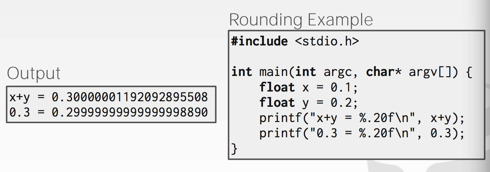

**固定精度的数字**

- 具有任意精度和规模的数据类型，当误差不可接受时使用，如NUMERIC,DECIMAL
- 通常存储在精确的可变长度二进制文件中并附加元数据表示

**超大的值**

- 大多数DBMS不允许元组超过单个页面大小
- 存储大于一个页面的值，DBMS使用单独的溢出存储页(overflow page)存储
  - Postgres：TOAST (> 2KB)
  - MySQL：Overflow (> 1/2 size of page)

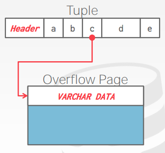

**外部值存储（External value storage）**

- 一些系统允许你在一个外部文件中存储一个很大的值
- 作为BLOB类型处理
  - Oracle：BFILE 
  - Microsoft：FILESTREAM

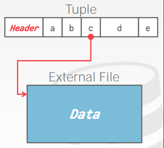

- DBMS无法操作外部文件的内容
  - 无持久化保护
  - 没有事务保护

**系统目录 (System catalogs)**

- 一个数据库的元数据是存储在其数据库内部的catalogs
  - Tables，columns，indexes，views
  - Users，permissions
  - Internal statistics（内部统计)
- 几乎每个DBMS都存储其数据库的目录
- 你可以查数据库内部的information_schema来获取数据库信息
- ANSI的标准提供了一系列的视图包括表，视图，列，过程
- DBMS也有非标准的快捷方式来检索这些信息

**OLTP**

- On-line Transaction Processing（在线事务处理）
- 读取和更新数据库中的单个实体的小量数据

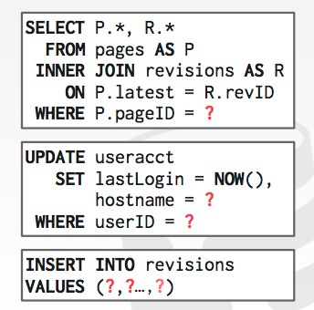

**OLAP**

- On-line Analytical Processing (在线分析处理)
- 读取跨越多个实体的大量数据的复杂查询

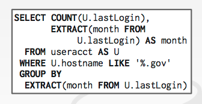

**数据存储模型**

- 为了使OLTP或者OLAP性能更好，DBMS用不同的方式存储元组

**N-ARY STORAGE MODEL (NSM)**

- DBMS在一个页面中连续的存储单个元组，每个元组存储了所有的属性
- 适用于OLTP的工作负载，尽在单个实体上操作，大量的插入工作负载

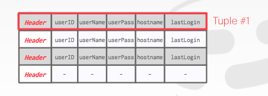

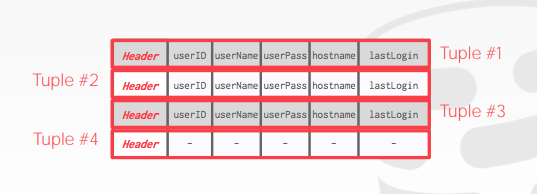

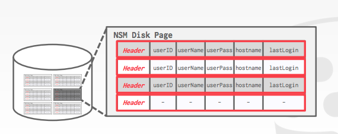

- NSM优点：快速插入，更新，删除元组
- NSM缺点：不适合表的部分属性扫描

**DECOMPOSITION STORAGE MODEL (DSM)**

- DBMS在页中相邻的所有元组中存储单个属性的值
- 比较出名的是“列族存储”
- 适用于只读的OLAP查询工作，比如scan某个属性的所有值

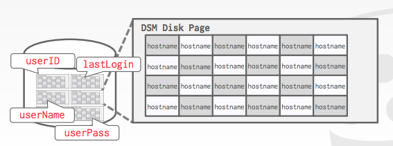

- DSM优点：减少浪费的I/O请求量，因为DBMS只读区所需要的数据；更好的处理查询任务和数据压缩。
- DSM缺点：单个元组的查询、插入、更新和删除速度慢，因为元组属性被分散在不同的页面中。