**表索引**

- 表索引时表列子集的副本，这些列是使用这些列的字集进行组织排序以达到高效访问的目的。

- DBMS确保表和索引的内容在逻辑上同步。
- DBMS的工作是找出执行每个查询所使用的最佳索引。
- 对于每个数据创建的索引数量有一个权衡。
  - 存储开销
  - 维护开销

**B树家族**

- 有一种特殊的数据结构称为B树，但人们也使用这个术语来泛指一类数据结构
  - B-Tree
  - B+Tree
  - B link-Tree
  - B*Tree

**B+树**

- B+树是一种自平衡的数据结构，它保持数据的排序，并允许在O (log n)中进行搜索、顺序访问、插入和删除
- 而叉搜索树的推广，即一个节点可以有两个以上的子节点
- 对读取和写入大量数据的系统进行了优化

**B+树属性**

- 一个B+树是一个M-way，它具有以下属性
  - 它是完全平衡的（即每个叶节点在同一深度）
  - 除了root节点外的任何内部节点，至少半满 (M/2 - 1 <= #keys <= M-1)
  - 具有k个键的每个内部子节点都有 k+1个非空子节点

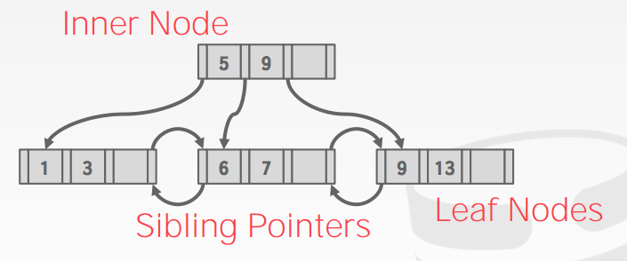

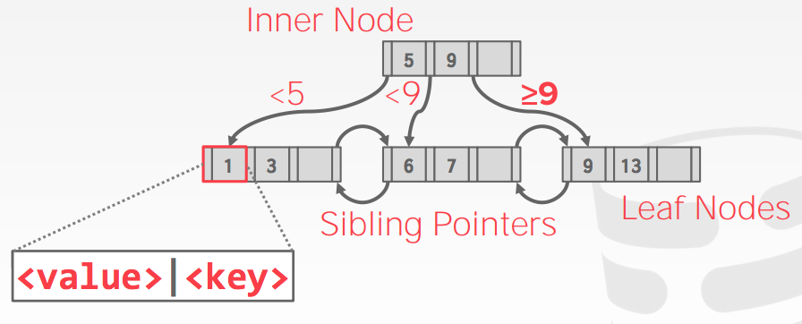

- B+树中每个节点都包含一个键/值对数组

- 键将始终是在其上构建索引的一列或多列
- 这些值将根据节点属于内部节点还是叶节点而有所不同
- 这些数组通常按照键排序保存

**叶节点的值**

- 一：记录ID，指向索引项所对应的元组位置的指针
- 二：元组数据，元组的实际内容存储在叶节点中；二级索引必须将记录ID存储为其值

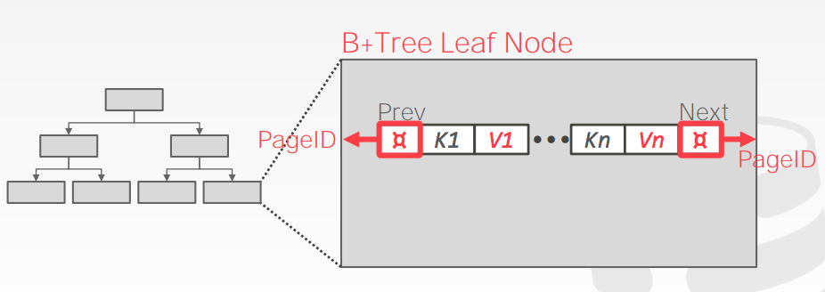

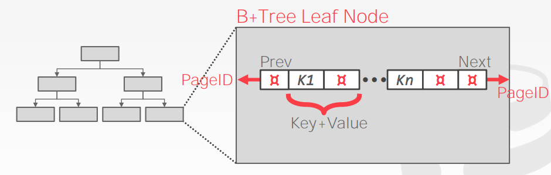

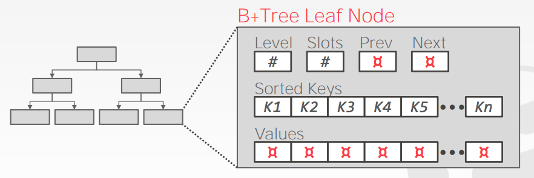

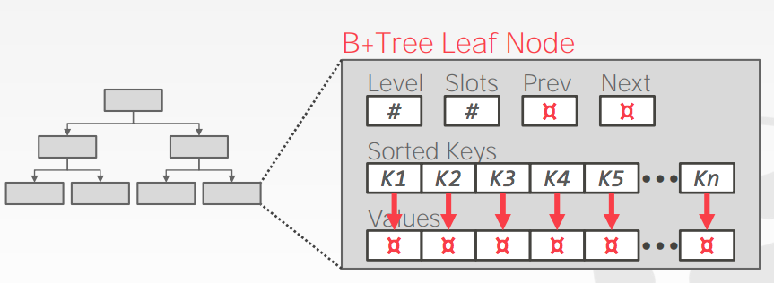

**B树和B+树**

- 1972年原始的B树中的所有节点中存储了key和value对
- 更节省空间，因为每个键在树中只出现一次
- B+树只在叶节点中存储值。内部节点只指导搜索过程

**B+树插入**

- 找到正确的叶L
- 以顺序的方式将数据项插入L中
- 如果 L 有足够的空间，操作完成
- Else : 必须将L切分成 L 和一个新的节点 L2
- 均匀的分配entry，复制中间键
- 将指向L2的索引项插入L的父级节点中
- 要拆分内部节点，请均匀地重新分布条目，但向上推中间键

**B+树的可视化**

- https://cmudb.io/btree

**B+树的删除**

- 从根开始，找到条目所属的叶L
- 删除entry
- 如果 L 至少半满，操作完成
- 如果L只有M/2 - 1，
  - 尝试重新分布，从兄弟节点借用空间
  - 如果重新分发失败，合并L和兄弟节点
- 如果发生合并，必须从L的父节点删除条目（指向L或同级节点）

**实际中的B+树**

- 典型的填充系数：67%
- 平均扇出：2 * 100 * 0.67 = 134
- 典型的容量值：
  - 高4:1334 = 312,900,721个 元素
  - 高3:1333 = 2,406,104个 元素

- 每级的页数
  - Level 1 = 1 page = 8 KB
  - Level 2 = 134 pages = 1 MB
  - Level 3 = 17,956 pages = 140 MB

**聚集索引**

- 表按主键指定的排序顺序存储
- 可以是堆或者索引组织存储

- 一些DBMS总是使用聚集索引
- 如果一个表不包含一个主键，DBMS会自动的生成一个隐藏的row id主键

**选择条件**

- 如果查询提供搜索键的任何属性，DBMS可以使用B+树索引
- 例如：<a, b, c>上的索引
  - 支持搜索：（a = 5 AND b = 3）
  - 支持：(b = 3)
- 对于哈希索引，搜索键中必须包含所有属性

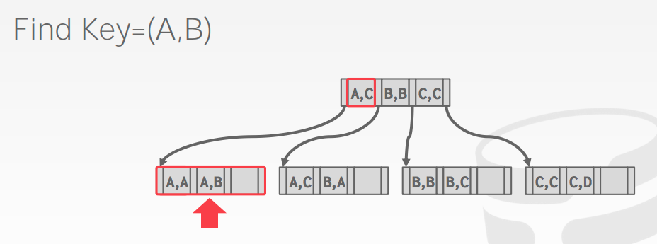

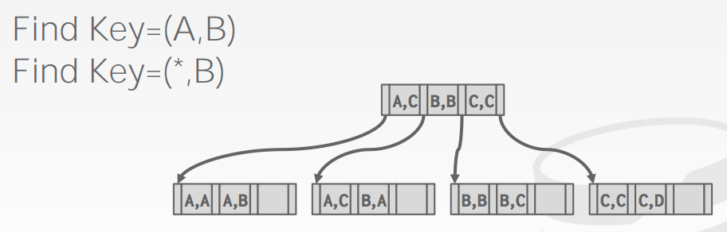

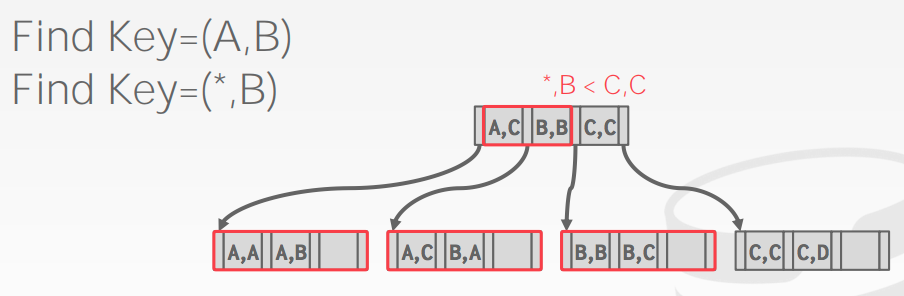

**B+树设计的选择**

- 节点大小
- 合并阈值
- 可变长度的键
- 非唯一的索引
- 节点内搜索

**节点的大小**

- 磁盘越慢，B+树的最佳节点大小越大
  - HDD ～1MB
  - SSD： ～10KB
  - In-Memory：~512B
- 根据workload的不同，最佳大小也会有所不同

**合并阈值**

- 一些DBMS不总是合并处于半满状态的节点
- 推迟合并操作可能会减少重组的数量
- 最好让下溢存在，然后定期重建整个树

**可变长度的key**

- 方法一、指针
  - 以指针的方式存储keys指向元组属性
- 方法二、可变长度的节点
  - B+树中的每个节点大小可以变化
  - 需要谨慎的内存管理
- 方法三、Key Map
  - 在节点内嵌入映射到键+值列表的指针数组

**非唯一索引**

- 方法一：复制键
  - 使用相同的叶节点布局，但是多次存储重复的键

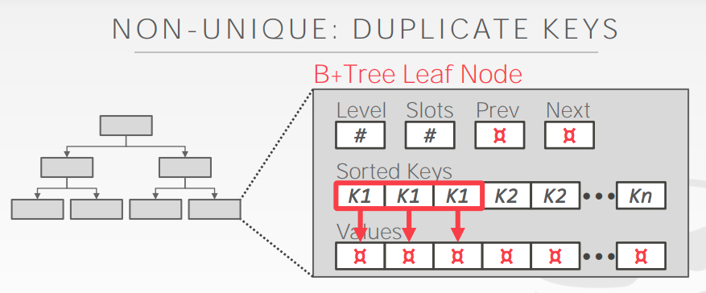

- 方法二：值列表
  - 只存储每个键一次，并维护唯一值的链接列表

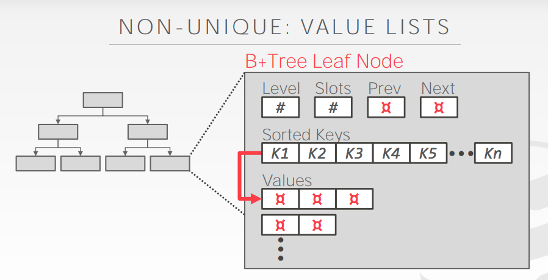

**节点内部搜索**

- 方法一：线性搜索，从头到尾扫描键
- 方法二：二分搜索，跳到中间key，根据比较向左/向右寻找
- 方法三：基于已知key的分布估计所需key的近似位置

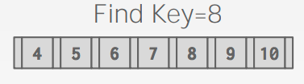

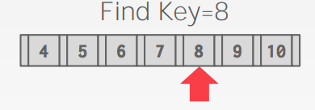

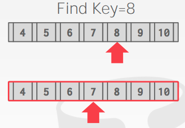

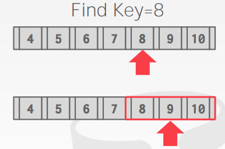

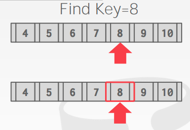

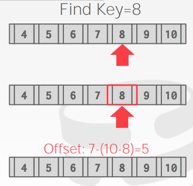

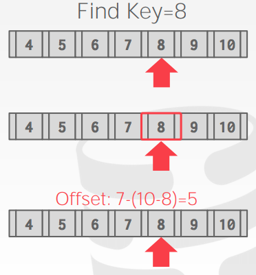

**优化操作**

- 前缀压缩
- 后缀截断
- 批量插入
- 指针旋转

**前缀压缩**

- 同一叶节点的已排序键可能具有相同的前缀
- 不是每次都存储整个key，而是提取公共前缀并只存储每个key的唯一后缀

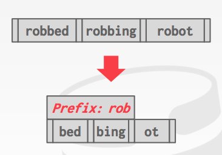

**后缀截断**

- 内部节点中的键仅用于“引导通信”，我们并不需要存储整个key的值
- 存储将探针正确路由到索引所需要的最小前缀

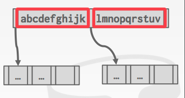

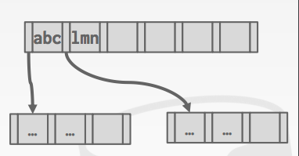

**批量插入**

- 构建B+树的最快/最好的方法是对键进行排序，然后自下而上构建索引

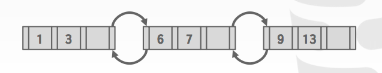

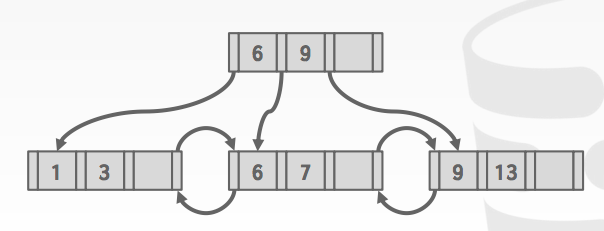

**指针旋转**

- 节点使用页面ID引用索引中的其他节点。在遍历期间，DBMS必须从页表中获取内存位置。
- 如果页面固定在缓冲池中，那么我们可以存储原始指针而不是页面ID，从而消除了从页面表中获取地址的需要。

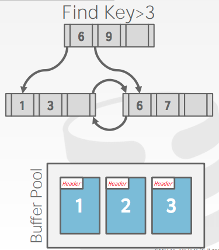

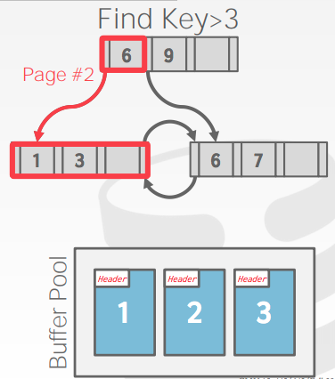

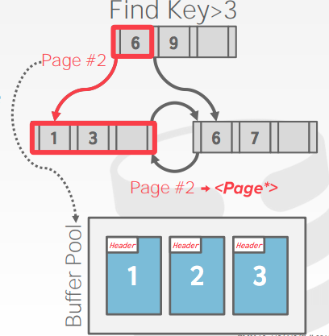

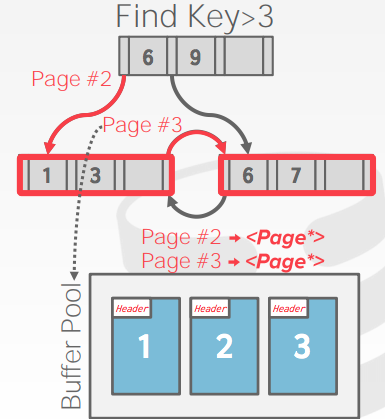

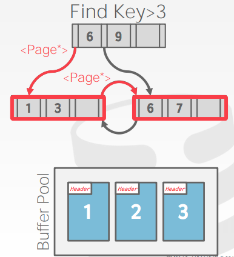

