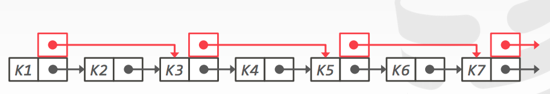

**隐式索引**

- 大多数DBMS自动创建一个索引来确保完整性约束
  - 主键
  - 唯一约束
  - 外键

**部分索引**

- 在整个表的子集上创建索引。这可能会减少它的大小和维护它的开销。

**覆盖式索引**

- 如果处理查询所需的所有字段都在索引中可用，那么DBMS不需要检索元组
- 这就减少了对DBMS缓冲池的争用

**索引包含列**

- 在索引中嵌入其他列以支持仅索引查询，不是搜索键的一部分。

**函数/表达式索引**

- 索引不需要以它们在基表中出现的方式存储键
- 声明索引时可以使用表达式

**实现动态顺序索引的最简单的方法是使用已排序的链接列表**

- 所有操作都是线性的搜索，平均开销O(N)

- 优化的方案

**跳跃列表**

- 具有跳过中间节点的额外指针的多级链接列表
- 在不需要全局重新平衡的情况下，按排序顺序维护keys

- 不同级别的列表集合
  - 最低级别是所有键的已排序、单独链接的列表
  - 第二级每隔一个键连接
  - 第三级隔4个键连接
  - 一般来说，一个级别下面有一半的键
- 要插入新的密钥，翻转coin以决定添加新密钥的级别。提供大致O(log n)搜索时间

**跳跃链表删除操作**

- 首先，通过设置一个标志告诉线程忽略，从索引中逻辑地删除一个键
- 一旦我们知道没有其他线程持有此引用，就可以物理地删除该键

- 跳表优点
  - 如果不包含反向指针，则使用的内存比典型的B+树少
  - 插入和删除不需要重新平衡
- 跳表缺点
  - 对磁盘缓存支持不友好，因为它们不优化引用的位置
  - 反向搜索是很重要的

**基数树 R-Tree**

- 将键表示伟单个数字的组合。这允许线程逐个检查前缀，而不是比较整个密钥
  - 树的高度取决于key的长度
  - 不需要重新平衡
  - 叶节点的路径表示叶节点的键
  - key是隐式存储的，可以从路径中重建

**基数树-二进制可比较的键**

- 并非所有属性类型都可以分解为基数树的二进制可比数字
  - Unsigned Intehers：对于小端机器，字节顺序必须翻转
  - Signed Integers：翻转两个补码，使负数小于正数
  - Floats：分类为组(负与正，规范化与非规范化)，然后存储为无符号整数
  - Compound：分别变换每个属性

**内存表索引性能比较**

**思考**

- 到目前为止，我们讨论过的树索引对于“点”和“范围”查询很有用
  - 查找15217邮政编码中的所有客户
  - 查找2018年6月至2018年9月之间的所有订单
- 它们不擅长关键词搜索
  - 查找包含“pavlo”一词的所有维基百科文章

**维基百科查询例子**

- 下面操作并不会帮助到我们的查询

**倒排索引**

- 倒排索引将单词映射到目标属性中包含这些单词的记录
  - 有时称为全文搜索索引
- 支持这个特性的主要数据库有：Solr，elastic search, Sphinx

**查询类型**

- 词组搜索
  - 查找按给定顺序包含单词列表的记录
- 临近搜索
  - 查找两个单词出现在彼此n个单词内的记录
- 通配符搜索
  - 查找包含符合某种模式的单词的记录

