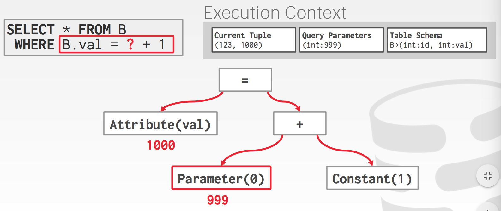

#### 查询计划

​	DBMS将SQL语句转换为查询计划。操作被安排在一棵树中。数据从叶节点流向根，树中根节点的输出是查询的结果，通常运算符是二进制的，同一个查询计划可以有多种执行方式，大多数DBMS都希望尽可能多地使用索引扫描。


#### 处理模型

DBMS处理模型定义了系统如何执行查询计划。对于不同的工作负载，不同的模型具有不同的权衡。

##### 迭代模型

这是最常见的处理模型，几乎每个DBMS都使用它

- 自顶向下处理
- 每一个查询计划操作实现一个next函数
  - 每次调用next时，如果没有更多的元组，则运算符返回单个元组或空标记
  - 运算符实现了一个循环，该循环对其子代节点调用next，以检查它们的元组，然后对它们进行处理

- 允许必须检索下一个元组之前，DBMS可以通过尽可能多的运算符处理元组的流水线操作

- 一些操作将被阻塞，直到子节点发出所有元组（连接，子查询，排序）
- 使用这种方法，输出控制很容易


#### 具体化模型

- 每个操作一次处理其输入，然后立即发出输出。操作将其输出‘具体化“为单个结果
- 从底向上执行
- 对于OLTP工作负载，此方法更好，因为查询通常一次只能访问少量元组。因此，检索元组的函数调用较少
- 不适合具有大型中间结果的OLAP查询


**矢量化模型**

- 就像迭代器模型一样，每个运算符都实现了next函数。但是每个运算符发出一批数据（即向量）而不是单个元组
- 从上向下执行
- 非常适合必须扫描大量元组的OLAP查询，因为next函数的调用次数较少


#### 访问方式

- 访问方式是DBMS访问数据表的方法，在关系代数中没有定义
- 三种基本方法
  - 顺序扫描
  - 索引扫描
  - 多索引/"位图"扫描

#### 顺序扫描

- 对于页表中的每一个页，从缓冲池中检索出来，迭代的访问每个元组，并检查是否包含它。
- DBMS维护了一个内部的光标，跟踪它检查的最后一个页/槽。

##### 顺序扫描的优化

- 预读(Prefetching)
- 并行化(Parallelization)
- 缓冲池旁路(Buffer Pool Bypass)
- 区域地图(Zone Maps)

###### Zone Maps

预先计算页面中属性值的聚合，DBMS首先检查区域地图以决定是否要访问该页面


- 延迟实现(Late Materialization)

##### Late Materialization

- DBMS可以延迟将元组缝合到一起，直到查询计划执行到上部


- 堆聚类

##### Heap Clustering

使用聚集索引指定的顺序对堆页中的元祖进行排序。

如果查询使用集群索引的属性访问元组，那么DBMS可以直接跳转到它需要的页面。


##### 索引扫描

```
SELECT * FROM students
WHERE age < 30
AND dept = 'CS'
AND country = 'US'
```

- 假设我们有一个表里面有100个元组和两个索引，索引1 age 索引2 dept

**多索引扫描**

- 如果表中有多个索引供DBMS用于查询
  - 对匹配的索引计算ids的集合
  - 根据查询的谓词组合这些集合（并集或者交集）
  - 检索纪录项并应用其余的检索条件

```
SELECT * FROM students
WHERE age < 30
AND dept = 'CS'
AND country = 'US'
```

上述语句的执行过程为

- 首先通过age < 30拿到记录的ids
- 其次通过dept='CS'拿到指定纪录的ids
- 求它们的交集
- 检索这些匹配出来的纪录检查country = 'US'是否满足

- 集合交集操作可以通过位图、哈希表或Bloom过滤器完成。


##### 索引扫描页排序

- 按照未出现在分类索引中的顺序检索元组效率很低
- DBMS可以首先找出它需要的所有元组，然后根据它们的页ID对它们进行排序


**表达式求值**

- DBMS将WHERE字句表示为表达式树

- 树中的节点表示不通的表达式类型
  - 比较 （=,<,>,!=）
  - 逻辑与 (AND)，逻辑或 (OR)
  - 数值运算操作(+,-,*,/,%)
  - 常量值
  - 元组属性引用





