- Tip 感觉很多话中文翻译过来很别扭，后续就全部用原文做笔记了

#### Sorting And Aggregations（聚合）

##### Why do we need to sort?

The tuples in a table have no specific order, But users often want to retrieve(检索) tuples in a specific order.

- to support DISTINCT Operation
- Bulk(大部分) loading sorted tuples into a B+ tree index is faster
- Aggragations(GROUP BY)

##### Think about sorting algorithms

If data fits in memory, then we can use a standard sorting algorithm like quick-sort.

If data does not fit in memory, then we need to use a technique that is aware of *the cost of writing data out to disk*.

##### External merge sort abstract

- Sorting Phase

Sort small chunks of  of data that fit in main-memory, and then write back the sorted data to a file on disk.

- Merge Phase

Combine sorted sub-files into a single larger file.

##### 2-WAY EXTERNAL MERGE SORT

Files are broken up(分裂) into N pages.

The DBMS has a finite(限定的) number of B fixed-size(固定大小) buffers.

**Pass #0**

- Reads every B pages of the table into memory
- Sorts them, and writes them back to disk
- Each sorted set of pages is called a run

**Pass #1,2,3**

- Recursively merges pairs of runs into runs twice as long
- Uses three buffer pages (2 for input pages, 1 for output)

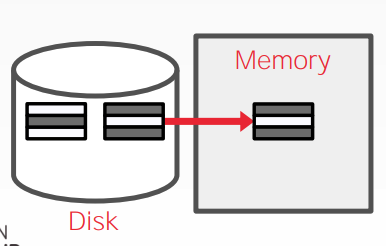

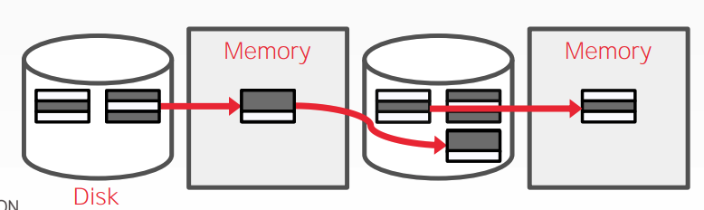

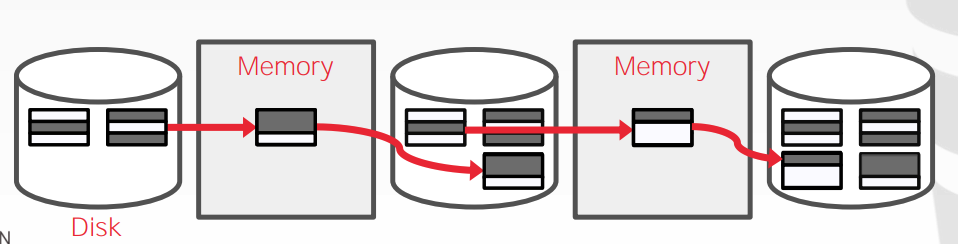

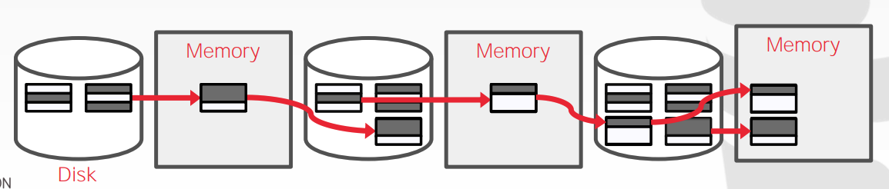

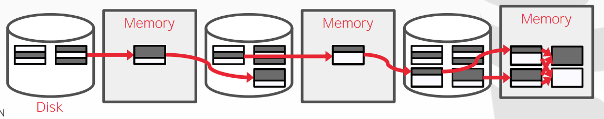

In each pass, we read and write each page in file.

Number of passes: 
$$
1 + \log_{2}{N}
$$
Total I/O cost：
$$
2N * (\# of-passes)
$$


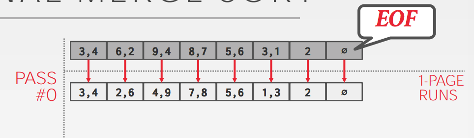

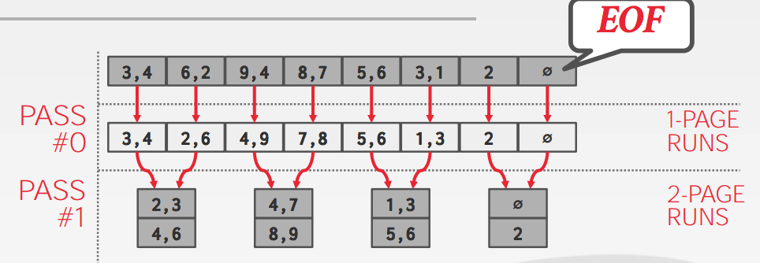

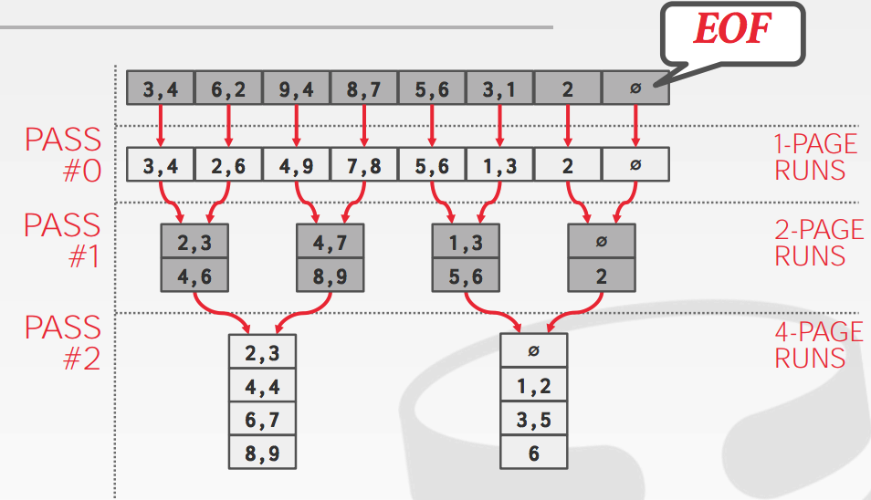

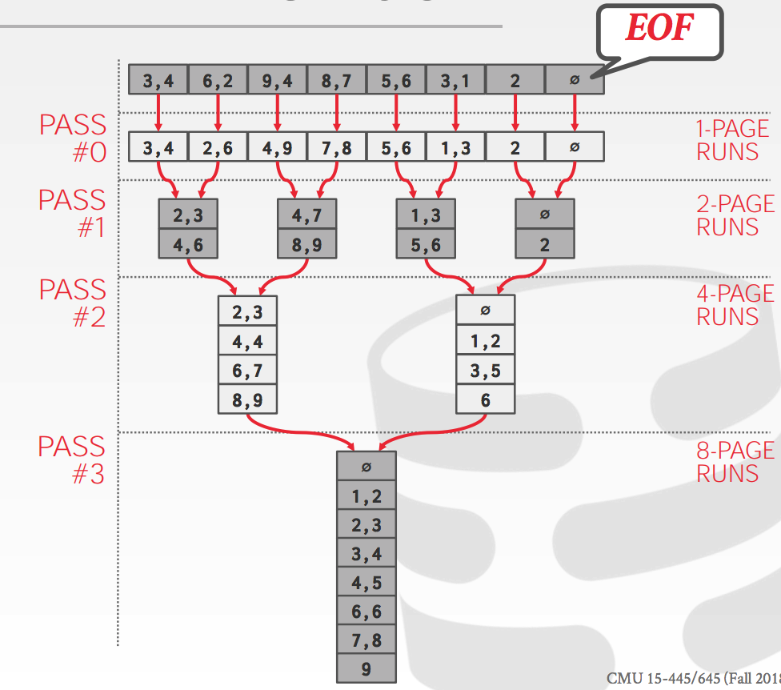

This algorithm only requires three buffer pages（B=3）

Even if we have more buffer space available (B > 3)， it does not effectively utilize them

##### General external merge sort

**Pass #0**

- Use B buffer pages
- Produce [N/B] sorted runs of size B

**Pass #1,2,3**

- Merge B-1 runs

Number of passes:
$$
1+ log_{B-1}{N/B}
$$
Tips：N/B和log运算的值都是向上取整

Total I/O Cost:
$$
2N * (\# of—passes)
$$

##### Using B+ Trees

If the table that must be sorted already has a B+ tree index on the sort attribute(s)，then we can use that to accelerate sorting

Retrieve tuples in desired sort order by simply traversing the leaf pages of the tree

##### Clustered B+ Tree

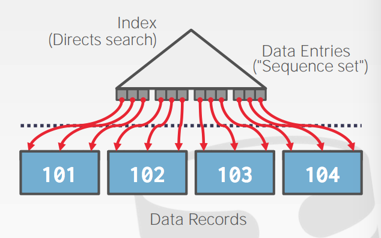

Traverse to the left-most leaf page, and then retrieve tuples from all leaf pages. This will always better than external sorting.

##### Unclustered B+ Tree

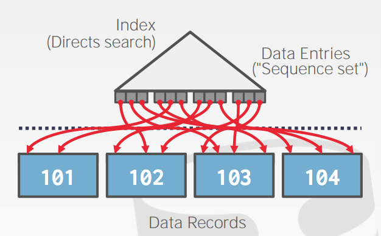

Chase each pointer to the page that contains the data.

This is almost always a bad idea. In general，one I/O per data record.

##### Aggregations

Collapse multiple tuples into a single scalar(标量) value

Two implementation choices:

Sorting, Hashing

##### Sorting aggregation

```
SELECT DISTINCT cid
FROM enrolled
WHERE grade IN('B', ''C)
```

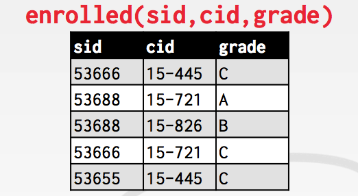

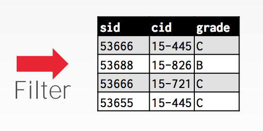

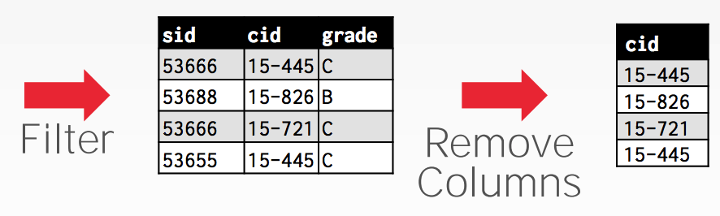

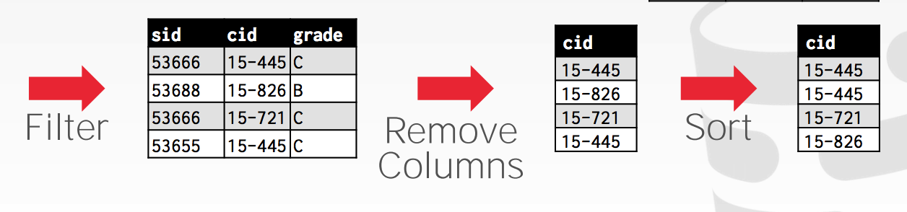

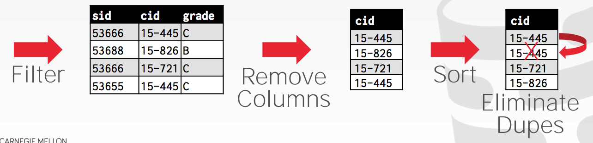

##### Alternatives（选择） to sorting

What if we don't need the data to be ordered?

- Forming groups in GROUP BY(no ordering)
- Removing duplicates in DISTINCT(no ordering)

Hashing is a better alternative in this scenario(方案).

- Only need to remove duplicates, no need for ordering.
- Can be computationally cheaper than sorting.

##### Hashing aggregate

Populate an ephemeral(临时的) hash table as the DBMS scans the table. For each record，check whether there is already an entry in the hash table:

- DISTINCT: Discard duplicate
- GROUP BY: Perform aggregate computation

If everything fits in memory, then it's easy. If we have to spill(溢出) to disk, then we need to be smarter...

Partition Phase: Divide tuples into buckets based on hash key

ReHash Phase: Build in-memory hash table for each partition and compute the aggregation.

##### Hashing aggregate phase #1: partition

Use a hash function h1 to split tuples into partitions on disk.

- We know that all matches live in the same partition.
- Partitions are "spilled" to disk via output buffers.

Assume that we have B buffers.

```
SELECT DISTINCT cid
FROM	enrolled
WHERE	grade IN('B','C')
```

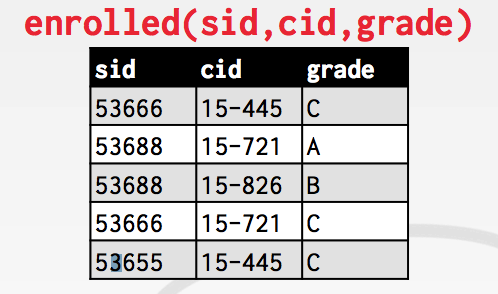

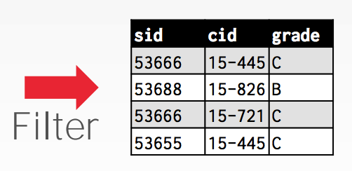

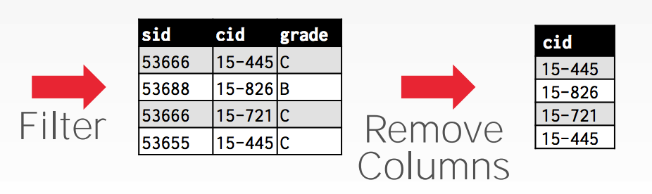

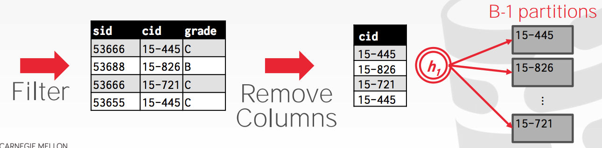

##### Hashing aggregate phase #2: rehash

For each partition on disk:

- Read it into memory and build an in-memory hash table based on a second hash function h2.
- Then go through each bucket of this hash table to bring together matching tuples.

This assumes that  each partition fits in memory.

```
SELECT DISTINCT cid FROM enrolled WHERE grade IN ('B', 'C')
```

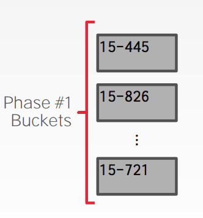

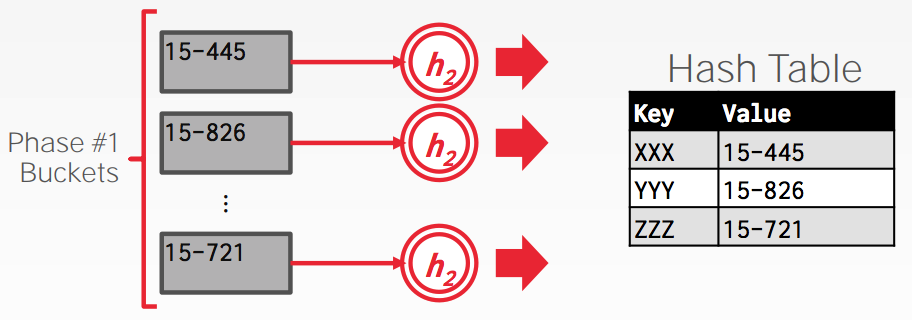

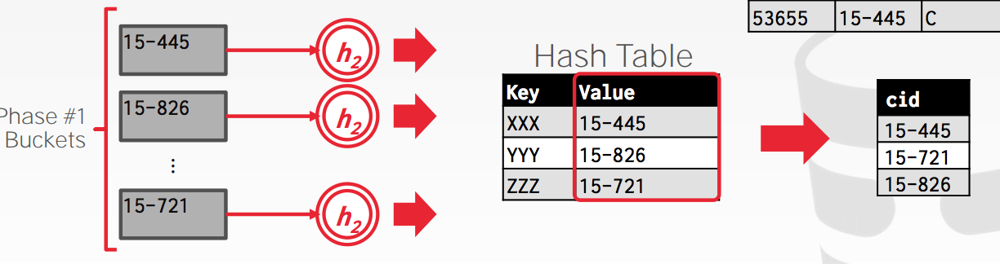

##### Hashing summarization

During the ReHash phase, store pairs of the form

 (GroupKey -> RunningVal)

When we want to insert a new tuple into the hash table:

- If we find a matching GroupKey, just update the RunningVal appropriately
- Else insert a new GroupKey->RunningVal

```
SELECT cid, AVG(s.gpa)
FROM student AS s, enrolled AS e
WHERE s.sid = e.sid
GROUP BY cid
```

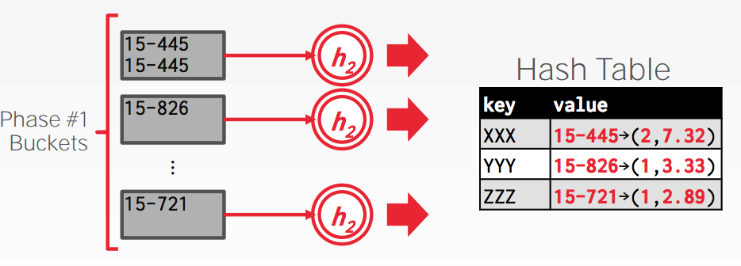

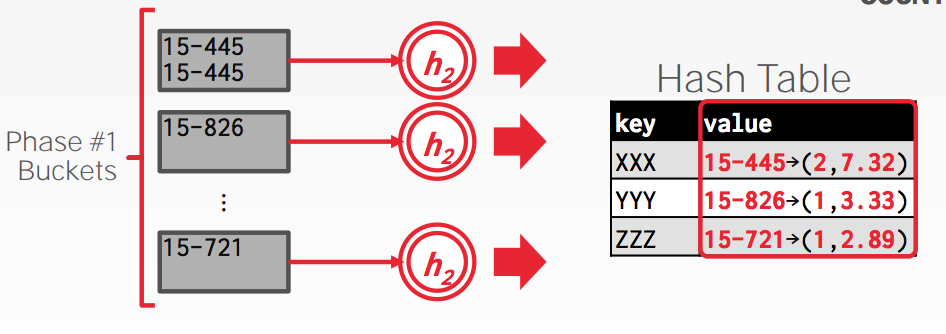

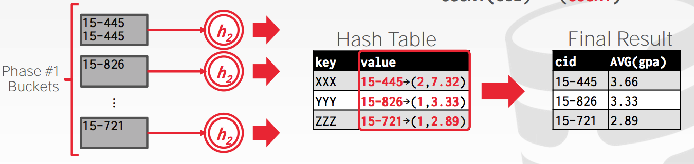

##### Cost analysis

How big of a table can we hash using this approach?

- B-1 "spill partitions" in Phase #1
- Each should be no more than B block big

Answer: B*(B-1)

- A table of N pages needs about sqrt(N) buffers Use a "fudge factor" f > 1 for that: we need B*sqrt(f * N)

##### Concusion

Choice of sorting vs. hashing is subtle(微妙的) and depends on optimizations done in each case.

We already discussed the optimizations for sorting:

- Chunk I/O into large blocks to amortize(摊销) seek+RD costs
- Double-buffering to overlap CPU and I/O