##### Why do we need to join?

We normalize(标准化) tables in a relational database to avoid unnecessary repetition(重复) of information.

We use the join operate to reconstruct(重建) the original tuples without any information loss.

##### Normalized tables

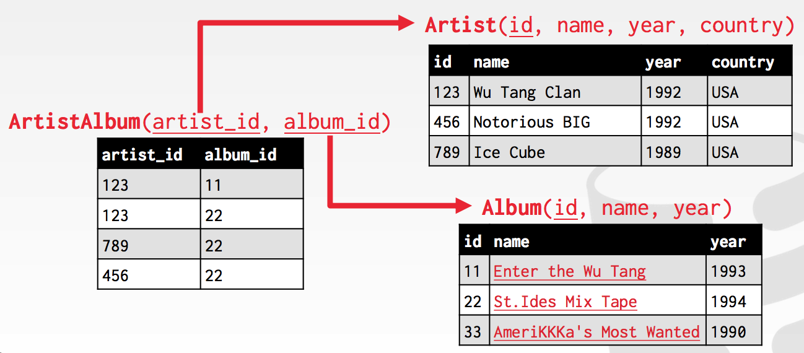

##### Join Algorithms

We will focus on joining two tables at a time. In general, we want the smaller table to always be the outer table.

##### Join Operator Output

For a tuple r belong to R and a tuple s belong to S that match on join attributes, concatenate(连接) r and s together into a new tuple.

Contents can vary(变化):

- Depends on processing model
- Depends on storage model
- Depends on the query

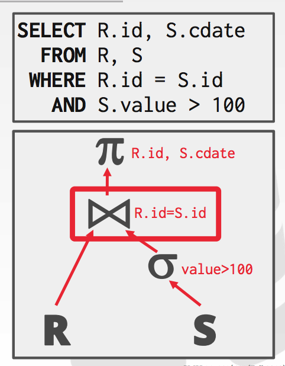

##### Join operator output: data

Copy the values for the attributes in outer and inner tuples into a new output tuple.

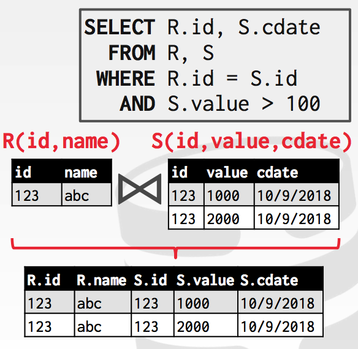

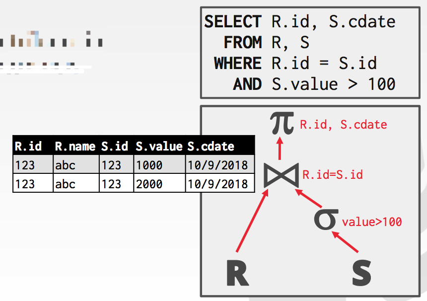

Subsequent operators in the query plan never need to go back to the base tables to get more data.

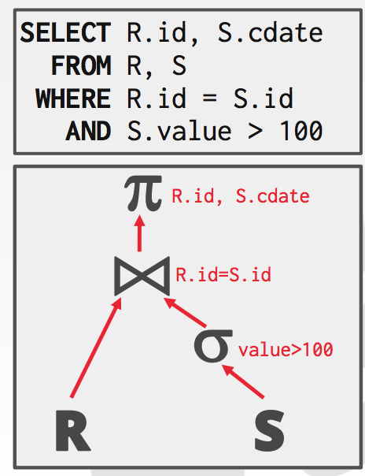


##### Join Operator output: record ids

Only copy the joins keys along with the record ids of the matching tuples.

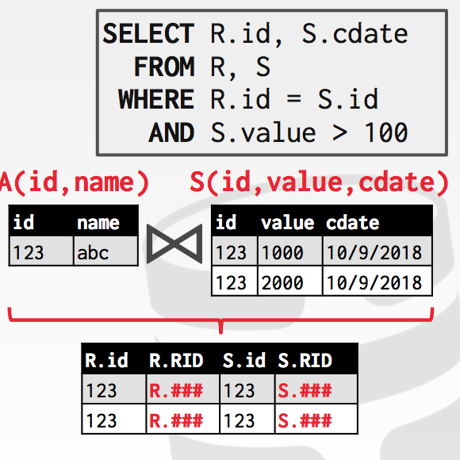

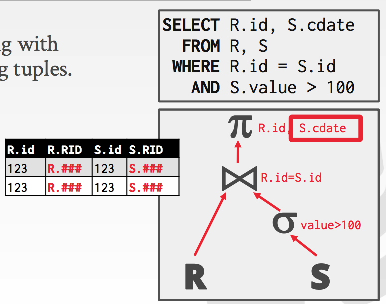

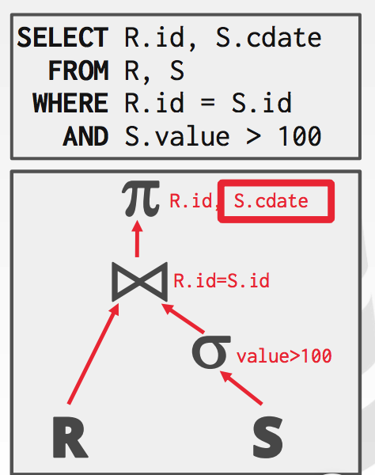

Ideal for column stores because the DBMS does not copy data that is not need for the query.

This is called late materialization.

##### Simple nested loop join

```
foreach tuple r ∈ R : <- Outer
	foreach tuple s ∈ S : <- Inner
	 emit , if r and s match
```

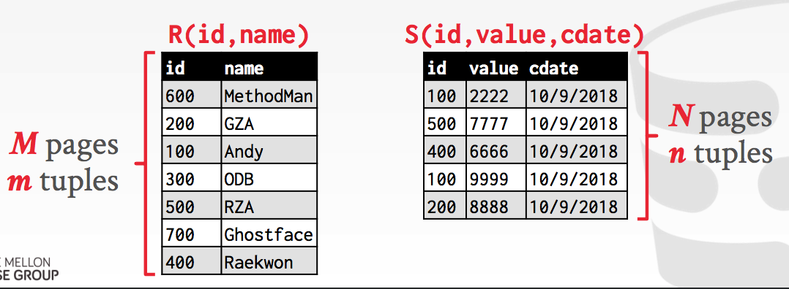

Why is this algorithm bad?

-> For every tuple in R, it scans S once

**Cost：M + (m * N)**

Example database:

-> M = 1000, m = 100,000

-> N = 500, n = 40,000

Cost Analysis:

-> M + (m * N) = 1000 + (100000 * 500) = 50,000,100 IOs

-> At 0.1 ms/IO, Total time = 1.3 hours

What if smaller table（S）is used as the outer table?

-> N + (n * M) = 500 + (40000 * 1000) = 40,000,500 Ios

-> At 0.1 ms/IO, Total time = 1.1 hours

##### Block nested(嵌套) loop join

```
foreach block BR ∈ R:
	foreach block BS ∈ S:
		foreach tuple r ∈ BR:
			foreach tuple s ∈ Bs:
				emit, if r and s match
```

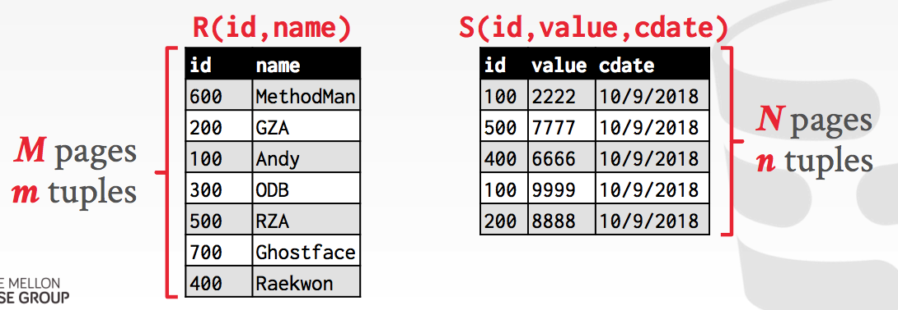

This algorithm performs fewer disk accesses.

-> for every block in R, it scans S one

Cost: M + (M* N)

Which one should be the outter table?

- The smaller table in terms of # of pages

Example databases:

-> M = 1000, m = 100,000

-> N = 500, n = 40,000

Cost Analysis:

-> M + (M * N) = 1000 + (1000 * 500) = 501,000 IOs

-> At 0.1 ms/IO, Total time = 50 seconds

What if we have B buffers available?

-> Use B-2 buffers for scanning the outer table.

-> Use one buffer for the inner table, one buffer for storing output.

```
foreach B - 2 blocks b(R) ∈ R
	foreach block b(S) ∈ S
		foreach tuple r ∈ b(R)
			foreach	tuple s ∈ b(S)
				emit , if r and s match
```

This algorithm uses B-2 buffers for scanning R.

Cost: M + ([M / (B - 2)] * N) (向上取整)

What of the outer relation completely fits in memory(B > M + 2)?

-> Cost: M + N = 1000 + 500 = 1500 IOs

-> At 0.1 ms/IO, Total time = 0.15 seconds

##### Index nested（嵌套的） loop join

Why do basic nested  loop joins suck ass(很糟糕)?

- For each tuple in the outer table, we have to do a sequential(顺序的) scan to check for a match in the inner table.

Can we accelerate(加快) the join using an index?

Use an index to find inner table matches.

- We could use an existing index for the join.
- Or even build one on the fly.

```
foreach tuple r ∈ R:
	foreach tuple s ∈ Index r(i) = s(j)):
		emit , if r and s match
```

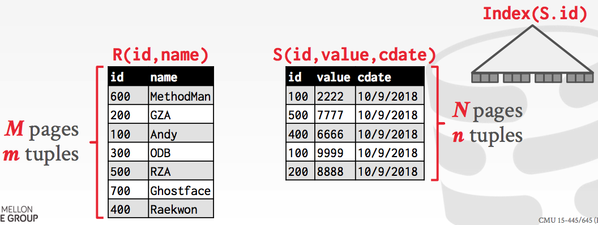

Assume the cost of each index probe is some constant C per tuple.

Cost: M + (m * C)

##### Nested loop join

Pick the smaller table as the outer table.

Buffer as much of the outer table in memory as possible.

Loop over the inner table or use an index.

##### Sort-merge join

Phase #1: Sort

- Sort both tables on the join key(s).
- Can use the external merge sort algorithm that we talked about last class.

Phase #2: Merge

- Step through the two sorted tables in parallel, and emit matching tuples.
- My need to backtrack(回溯) depending on the join type.

```
sort R,S on join keys
cursor(R) <- R(sorted), cursor(S)<- S(sorted)
while cursor(R) and cursor(S)
	if cursor(R) > cursor(S):
		increment cursor(S)
	if cursor(R) < cursor(S):
		increment cursor(R)
	elif cursor(R) and cursor(S) matcg:
		emit
		increment cursor(S)
```

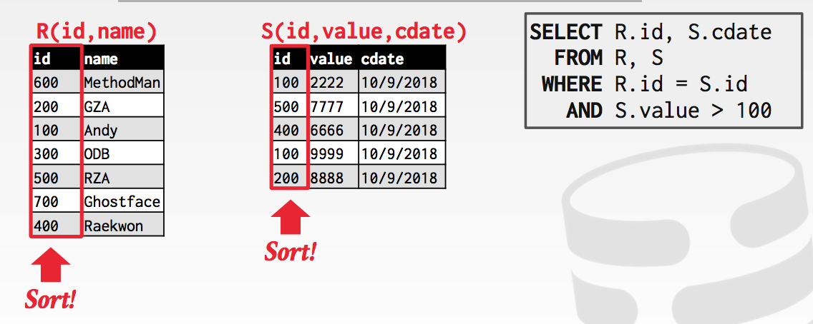

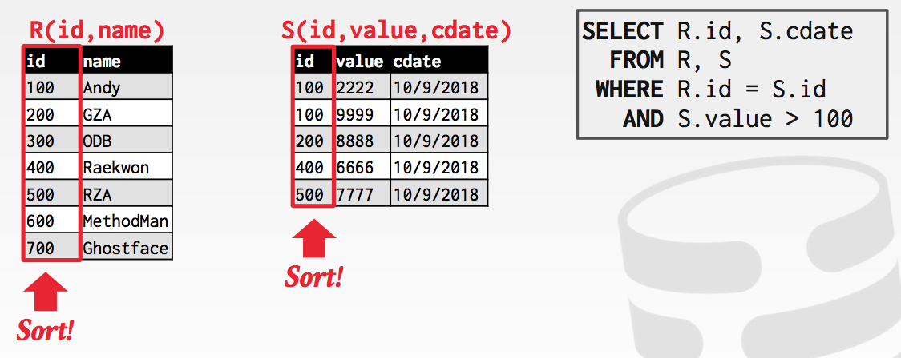

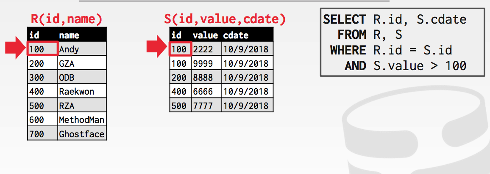

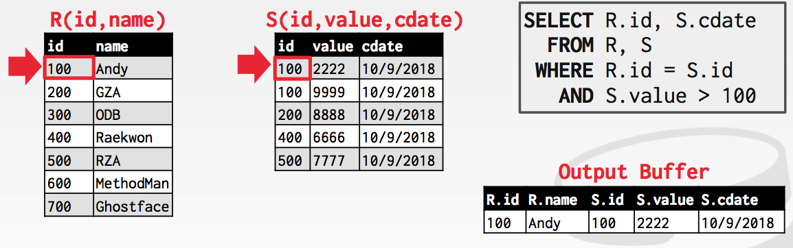

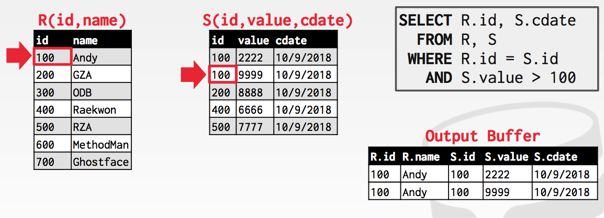

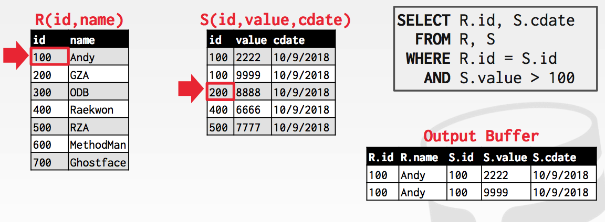

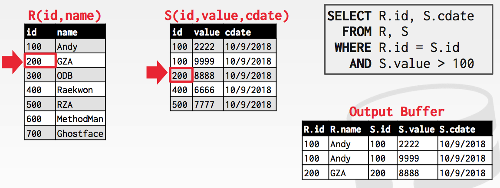

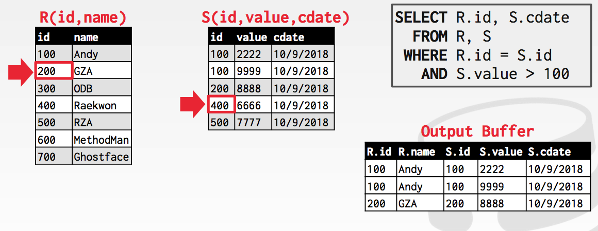

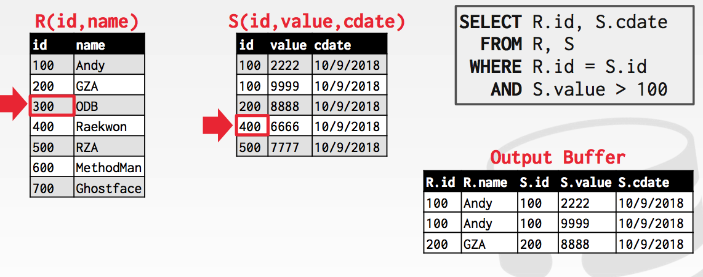

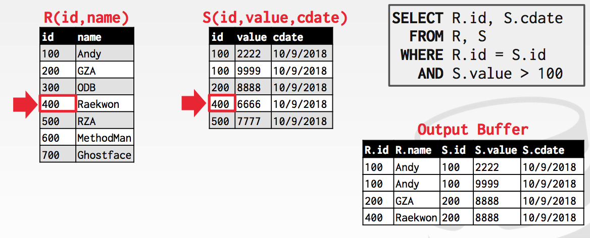

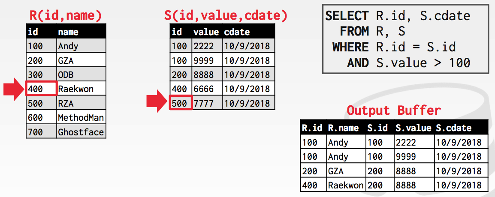

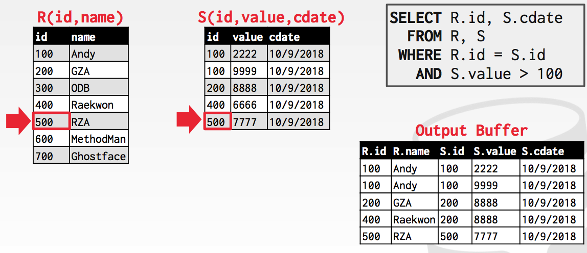

Sort Cost(R): 2M * (log M / log B)

Sort Cost(S): 2N * (log N / log B)

Merge Cost: (M + N)

Total Cost: Sort + Merge

Example database:

-> M = 1000, m = 100,000

-> N= 500, n = 40,000

With 100 buffer pages, both R and S can be sorted in two passes:

- Sort Cost(R) = 2000 * (log 1000 / log 100) = 3000 IOs
- Sort Cost(S) = 1000 * (log 500 / log 100) = 1350 IOs
- Merge Cost = (1000 + 500) = 1500 IOs
- Total Cost = 3000 + 1350 + 1500 = 5850 IOs
- At 0.1 ms/IO, Total time = 0.59 seconds

Cost: (M * N) + (sort cost)

##### When is sort-merge join useful?

One or both tables are already sorted on join key.

Output must be sorted on join key.

The input relations may be sorted by either by an explicit(明确的) sort operator, or by scanning the relation using an index on the join key.

##### Hash join

If tuple **r ∈ R** and a tuple **s ∈ S** satisfy（满足） the join condition（条件）, then they have the same value for the join attributes.

If that value is hashed to some value i, the R tuple has to be in r(i) and the S tuple in s(i).

Therefore, R tuples in r(i) need only to be compared with S tuples in s(i).

##### Basic hash join algorithm

Phase #1: Build

Scan the outer relation and populate a hash table using the hash function h1 on join attributes.

Phase #2: Probe

Scan the inner relation and use h1 on each tuple to jump to a location in the hash table and find a matching tuple.

```
build hash table HT(R) for R
foreach	tuple s ∈ S
	output , if h1 (s) ∈ HT(R)
```

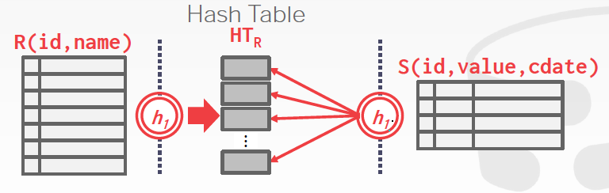

##### Hash table contents

Key: The attribute(s) that the query is joining the tables on.

Value: Varies per implementation.

Depends on what the operators above the join in the query plan expect as its input.

##### Hash table values

Approach #1: Full Tuple

Avoid having to retrieve(检索) the outer relation's tuple contents on a match.

Takes up more space in memory.

Approach #2: Tuple Identifier

Ideal for column stores because the DBMS doesn't fetch data from disk it doesn't need.

Also better if join selectivity(选择性) is low.

##### Hash join

What happens if we do not have enough memory to fit the entire hash table?

We do not want to let the buffer pool manager swap out the hash table pages at a random.

##### Grace hash join

Hash join when tables don't fit in memory.

Build Phase: Hash both tables on the join attribute into partitions(分区)

Probe(查看) Phase: Compares tuples in corresponding(相应的) partitions for each table.

Named after the GRACE database machine from Japan.

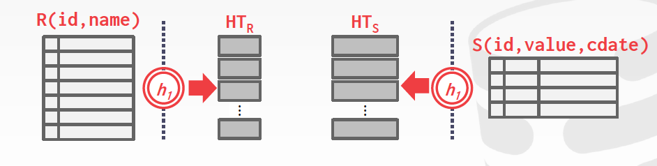

Hash R into (0,1,...,max) buckets.

Hash S into the same # of buckets with the same hash fuction.

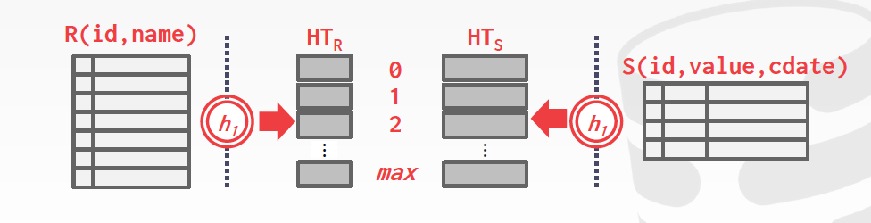

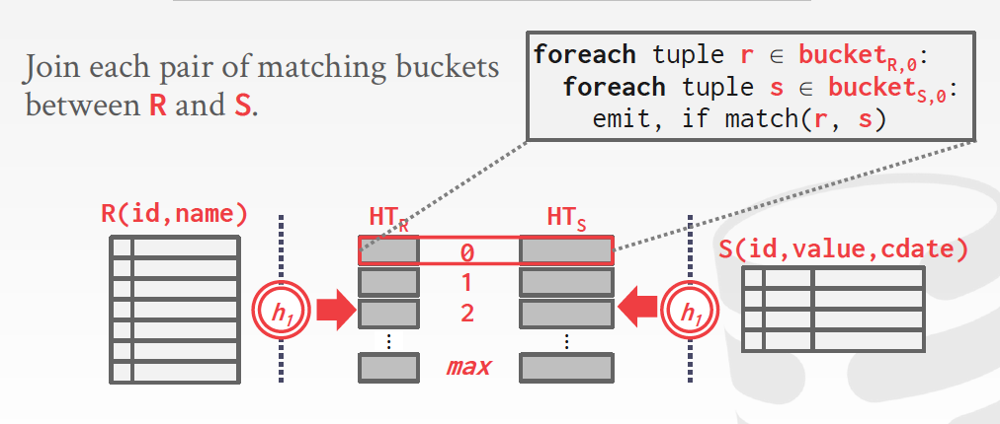

If the buckets do not fit in memory, then use recursive(递归的) partitioning to split the tables into chunks that will fit.

Build another hash table for bucket(R,i) using hash function h2 (with h2 != h1)

Then probe it for each tuple of the other table's bucket at that level.

##### Recursive partitioning

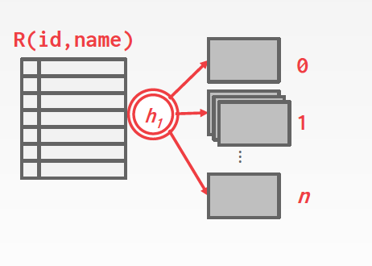

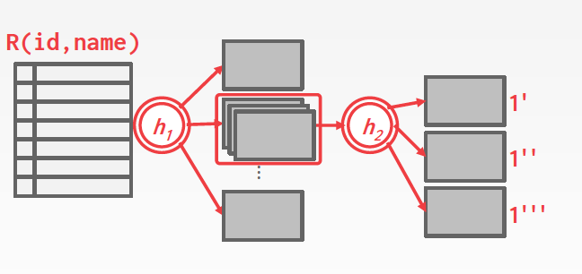

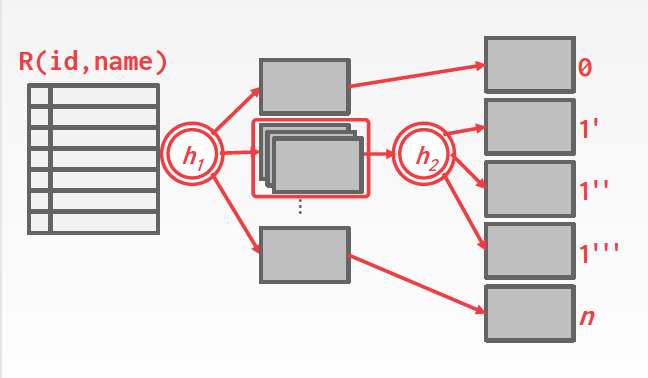

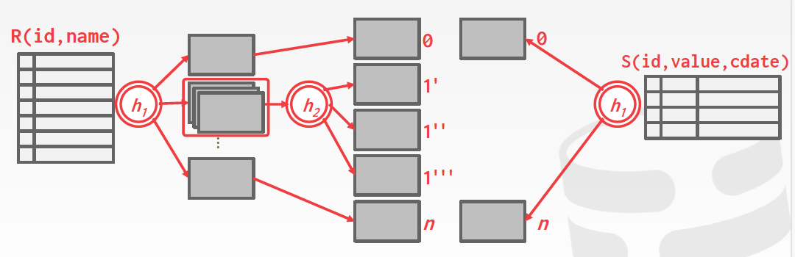

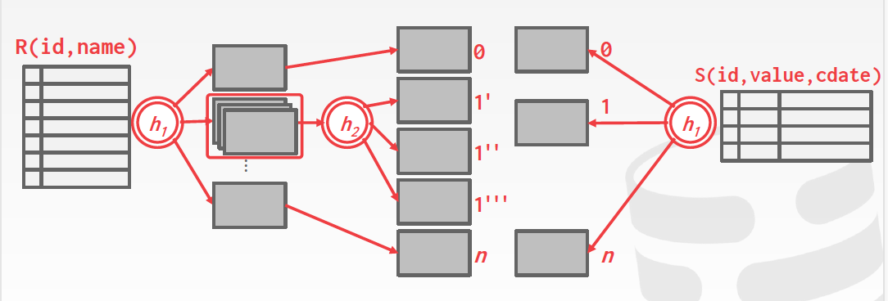

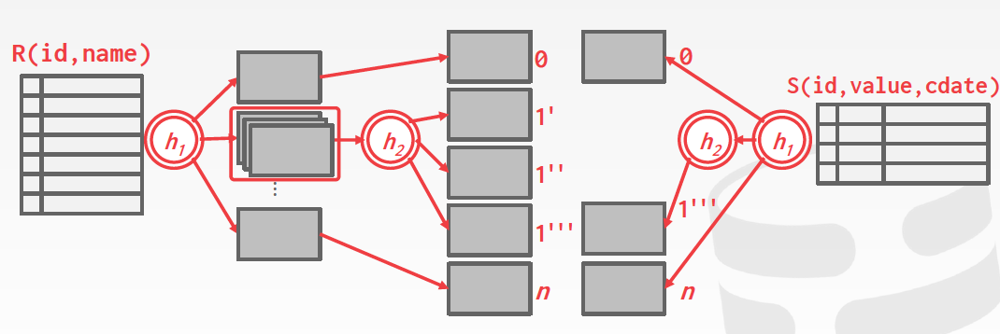

Cost of hash join?

Assume that we have enough buffers.

Cost: 3(M + N)

Partitioning Phase:

Read + Write both tables

2(M + N) IOs

Probing Phase:

Read both tables

M + N IOs

Example database:

M = 1000, m = 100,000

N = 500, n = 40,000

Cost analysis:

3 * (M + N) = 3 * (1000 + 500) = 4,500 IOs

At 0.1 ms/IO, Total time = 0.45 seconds

##### Join algorithms: summary

| **Algorithm**           | **IO Cost**           | **Example**  |
| ----------------------- | --------------------- | ------------ |
| Simple Nested Loop Join | **M+ (m * N)**        | 1.3 hours    |
| Block Nested Loop Join  | **M+ (M * N)**        | 50 seconds   |
| Index Nested Loop Join  | **M+ (m * C)**        | ~20 seconds  |
| Sort-Merge Join         | **M+ N+ (sort cost)** | 0.59 seconds |
| Hash Join               | **3(M+ N)**           | 0.45 seconds |

