##### IBM SYSTEM R

First implementation of a query optimizer.

People argued that the DBMS could never choose a query plan better than what a human could write.

A lot of the concepts from System R's optimizer are still used today.

##### Query optimization

Heuristics(启发) / Rules

Rewrite the query to remove stupid / inefficient things.

Does not require a cost model.

Cost-based Search

Use a cost model to evaluate multiple equivalent（相同）plans and pick the one with the lowest cost.

##### Query planning overview

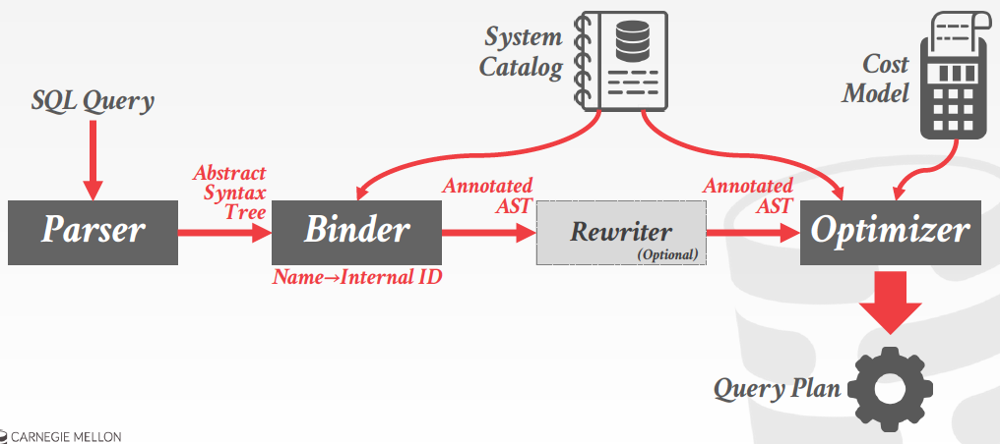

##### Relational algebra equivalences（关系代数等价）

Two relational algebra expressions are equivalent if they generate the same set of tuples.

The DBMS can identify better query plans without a cost model.

This is often called query rewriting

##### Predicate pushdown（谓词下推）

```
SELECT s.name, e.cid
FROM student AS a, enrolled AS e
WHERE a.sid = e.sid
AND e.grade = 'A'
```

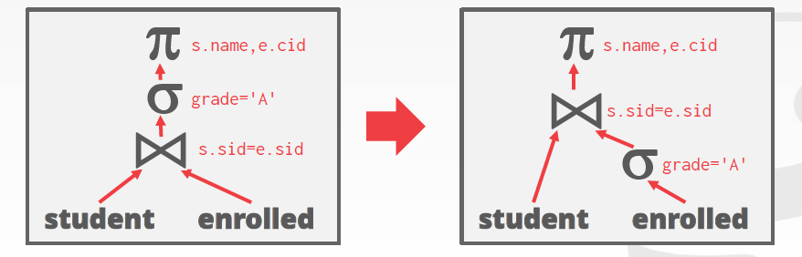


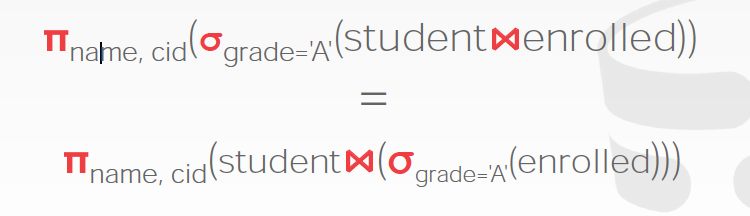

##### Relational algebra equivalences（关系代数等价）

Selections

Perform filters as early as possible

Recorder predicates so that the DBMS applies the most selective one first.

Break a complex predicate, and push down

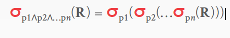

Simplify a complex predicate（谓词）

(X = Y AND Y = 3) -> X = 3 AND Y = 3

**Projections(预测)**

- Perform them early to create smaller tuples and reduce intermediate(中间的) results (if duplicates are eliminated（消除）)
- Project out all attributes except(除了) the ones requested or required(e.g., joining keys)

##### Predicate pushdown（谓词下推）

```
SELECT s.name, e.cid
FROM student AS s, enrolled AS e
WHERE s.sid = e.sid
AND e.grade = 'A'
```

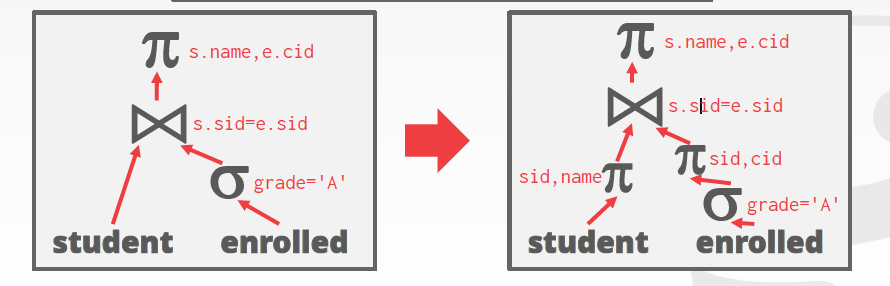

Impossible / Unnecessary Predicates

```
SELECT * FROM A WHERE 1 = 0;
```

```
SELECT * FROM A WHERE 1 = 1;
```

Join Elimination

```
SELECT A1.*
FROM A AS A1 JOIN A AS A2
ON A1.id = A2.id;
```

```
SELECT * FROM A;
```

Merging Predicates

```
SELECT * FROM A
WHERE val BETWEEN 1 AND 100
OR val BETWEEN 50 AND 150;
```

```
SELECT * FROM A
WHERE val BETWEEN 1 AND 150;
```

##### Relational algebra equivalences（关系代数等价）

**Joins**

Commutative(交换的)，associative(结合的)

##### Cost estimation (估算)

How long will a query take?

-> CPU: Small cost; tough to estimate

-> Disk: #of block transfers

-> Memory: Amount of DRAM used

-> Network: # of messages

##### Statistics(统计信息)

The DBMS stores internal statistic about tables, attributes, and indexes in its internal catalog.

Different systems update them at different times.

Manual invocations: （手动调用）

-> Postgres / SQLite: ANALYZE

-> Oracle / MySQL: ANALYZE TABLE

-> SQL Server: UPDATE STATISTICS

-> DB2: RUNSTATS

For each relation R , the DBMS maintains the following information:

-> N(R) : Number of tuples in R.

-> V(A, R) : Number of distinct(有区别的) values for attribute A

##### Derivable statistics (可推导的统计)

The selection cardinality (选择基数) SC (A, R) is the average number of records with a value for an attribute A given N(R) / V(A, R)

##### Selection statistics

Equality predicates on unique keys are easy to estimate.

```
SELECT * FROM people WHERE id = 123
```

```
SELECT * FROM people WHERE val > 1000
```

```
SELECT * FROM people WHERE age = 30 AND status = 'Lit'
```

The selectivity (选择性) (sel) of a predicate P is the fraction(分数) of tuples that qualify(符合条件)

Formula(公式) depends on type of predicate:

-> Equality 

-> Range

-> Negation （取反）

-> Conjunction （连接词）

-> Disjunction （逻辑或）

##### Selections - complex predicates

Assume that V(age, people) has five distinct values (0-4) and N(R) = 5

**Equality Predicate: A = constant**

sel(A = constant) = SC(P) / V(A, R)

Example: sel(age = 2) =

```
SELECT * FROM people WHERE age = 2
```

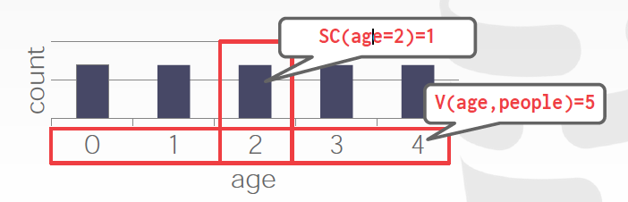

**Range Query**

sel(A >= a) = (A(max) - a) / (A(max) - A(min))

Example: sel(age >= 2) = (4 - 2) / (4 - 0) = 1 / 2

```
SELECT * FROM people WHERE age >= 2
```

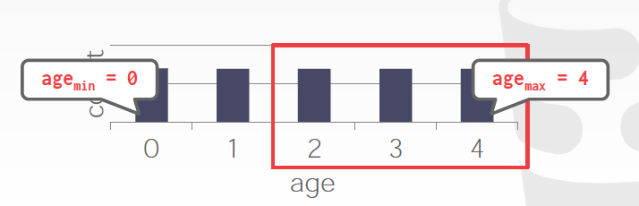

**Negation Query**

sel ( not P ) = 1 - sel( p )

Example: sel ( age != 2 )

```
SELECT * FROM people WHERE age != 2
```

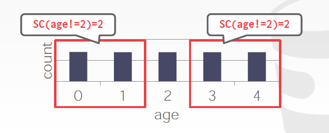

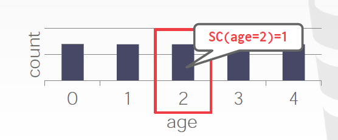

*Observation: Selectivity ~= Probability*

**Conjunction**

sel (P1 ^ P2) = sel(P1) * sel(P2)

sel (age = 2 ^ name LIKE 'A%' )

```
SELECT * FROM people WHERE age = 2 AND name LIKE 'A%'
```

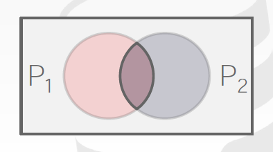

**Disjunction**

sel(P1 U P2) 

= sel(P1) + sel(P2) - sel(P1 ^ P2)

= sel(P1) + sel(P2) - sel(P1) * sel(P2)

-> sel(age = 2 OR name LIKE 'A%')

```
SELECT * FROM people WHERE age = 2 OR name LIKE 'A%'
```

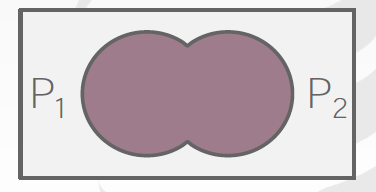

##### Query Optimization

After performing rule-based rewriting, the DBMS will enumerate(列举) different plans for the query and estimate(估计) their costs.

Single relations

Multiple relations

Nested(嵌套) sub-queries

It chooses the best plan it has been for query after exhausting(用尽) all plans or some timeout

Simple heuristics(启发式) are often good enough for this

OLTP queries are especially easy

##### OLTP Query planning

Query planning for OLTP queries is easy because they are sargable（可分析的）

Search Argument Able

It is usually just picking the best index

Joins are almost always on foreign key relationships with a small cardinality（基数）

Can be implementation with simple heuristics

