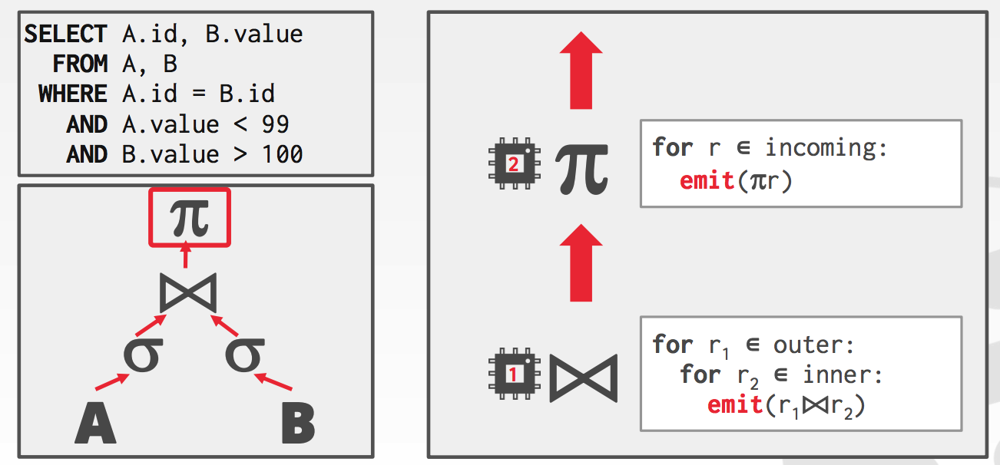
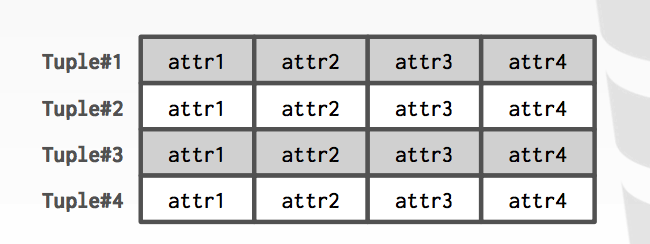

##### Parallel VS distributed

Database is spread out(分散) across multiple resources to improve parallelism.

Appears as a single database instance to the application.

- SQL query for a single-node DBMS should generate same result on a parallel or distributed DBMS.

**Parallel DBMSs**

- Nodes are physically close to each other.
- Nodes connected with high-speed LAN.
- Communication cost is assumed to be small.

**Distributed DBMSs**

- Nodes can be far from each other.
- Nodes connected using public network.
- Communication cost and problems cannot be ignored.

##### Inter- vs. Intra-query parallelism(查询间并行，查询内并行)

**Inter-Query**  Different queries are executed concurrently.

Increases throughput & reduces latency.

**Intra-Query** Execute the operations of a single query in parallel.

Decreases latency for long-running queries.

A DBMS's process model defines how the system in architected to support concurrent requests from a multi-user application.

A worker is the DBMS component that is responsible for executing tasks on behalf of the client and returning the results.

##### Process per worker

Each worker is a separate OS process.

- Relies on OS scheduler.
- Use shared-memory for global data structures.
- A process crash doesn't take down entire system.
- Examples: IBM DB2, Postgres, Oracle


##### Process pool

A worker uses any process that is free in a pool 

- Still relies on OS scheduler and shared memory.
- Bad for CPU cache locality.
- Example: IBM DB2, Postgres


##### Thread per worker

Single process with multiple worker threads.

- DBMS has to manage its own scheduling.
- May or may not use a dispatcher thread.
- Thread crash(may) kill the entire system.
- Example: IBM DB2, MSSQL, MySQL, Oracle (2014)


##### Process models

Using a multi-threaded architecture has several advantages:

- Less overhead per context switch

- Don't have to manage shared memory

The thread per worker model does not  mean that you have intra-query parallelism.

I am not aware of any new DBMS built in the last 10 years that doesn't use threads.

##### Scheduling

For each query plan, the DBMS has to decide where, when, and how to execute it.

- How many tasks should it use?
- How many CPU cores should it use?
- What CPU core should the tasks execute on?
- Where should a task store its output?

The DBMS always knows more than the OS.

##### Inter-query parallelism

Improve overall performance by allowing multiple queries to execute simultaneously(同时的).

If queries are read-only, then this requires little coordination(协调) between queries.

If queries are updating the database at the same time, then this is hard to fo this correctly.

- Need to provide the illusion(假象) of isolation

Improve the performance of a single query by executing its operators in parallel

There are parallel algorithms for every relational operator.

**Approach #1: Intra-Operator(Horizontal-水平)**

- Operators are decomposed(分解) into independent instances that perform(执行) the same function on different subsets of data.

The DBMS inserts an exchange operator into the query plan to coalesce(合并) results from children operators.


**Approach #2: Inter-Operator(Vertical-垂直)**

- Operations are overlapped(重叠的) in order to pipeline data from one stage to the next without materialization(实现)，It also called pipelined parallelism





AFAIK(据我所知), this approach is not widely used in traditional relational DBMSs.

- Not all operators can emit output until they have seen all of the tuples from their children

This is more common in stream processing systems


Using additional processes/threads to execute queries in parallel won't help help if the disk is always the main bottleneck(瓶颈)

- Can actually make things worse if each worker is reading different segments of disk

##### I/O Parallelism

Split the DBMS installation across multiple storage devices

- Multiple Disk per Database
- One Database per Disk
- One Relation per Disk
- Split Relation across Multiple Disks

##### Multi-disk parallelism

Configure OS/hardware to store the DBMS's files across multiple storage devices.

- Storage Appliances
- RAID Configuration
- This is transparent(透明的) to the DBMS


##### DataBase partitioning

Some DBMSs allow you specify the disk location of each individual（独立的） database.

- The buffer pool manager maps a page to a disk location

This is also easy to do at the filesystem level if the DBMS stores each database in a separate directory.

- The log file might be shared though

Split single logical table into disjoint(不相交的) physical segments that are stored/managed separately(单独的).

Ideally partitioning is transparent to the application.

- The application  accesses logical tables and doesn't care how things are stored.
- Not always true.

##### Vertical(垂直) partitioning

Store a table's attributes in a separate location(e.g, file, disk volume)

Have to store tuple information to reconstruct(重建) the original record

```
CREATE TABLE foo (
attr1 INT,
attr2 INT,
attr3 INT,
attr4 TEXT
);
```


##### Horizontal partitioning

Divide the tuples of a table up into disjoint segments based on some partitioning key

- Hash Partitioning
- Range Partitioning
- Predicate(谓词) Partitioning




Parallel execution is important (Almost) every DBMS support this.

This is really hard to get right.

- Coordination Overhead（协调开销）
- Scheduling 
- Concurrency Issues
- Resource Contention

