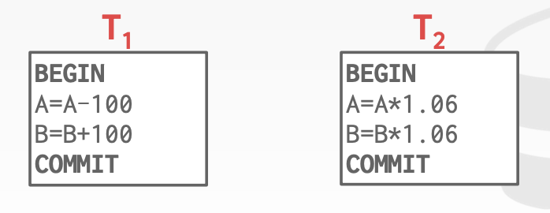

##### Semester(学期) status 

A DBMS's concurrency control and recovery components permeate(渗透) throughout the design of its entire architecture.

##### Motivation

We both change the same record in a table at the same time.

How to avoid race(竞争) condition? (Lost Updates Concurrency Control)

You transfer $100 between bank accounts but there is a power failure.

What is the correct database state? (Durability Recovery)

##### Concurrency control & recovery

Valuable properties of DBMSs (DBMS的重要特性)

Based on concept of transactions with ACID properties.

##### Transactions

A transaction is the execution of a sequence of one or more operations (e.g., SQL queries) on a shared database to perform some higher-level function.

It is the basic unit of change in DBMS

**Example**

Move $100 from Andy' bank account to his bookie's account.

Transaction:

- Check whether Andy has $100.

- Deduct $100 from his account.

- Add $100 to his bookie's account.

##### Strawman System

Execute each txn one-by-one(i.e., serial order) as they arrive at the DBMS.

- One and only one txn can be running at the same time in the DBMS.

Before a txn starts, copy the entire database to a new file and make all changes to that file.

- If the txn completes successfully, overwrite the original file with the new one.
- If the txn fails, just remove the dirty copy.

##### Definitions

A txn may carry out many operations on the data retrieved from the database

However, the DBMS is only concerned about what data is read/written from/to the database.

- Changes to the "outside world" are beyond the scope of the DBMS.

##### Formal Definitions

Database: A fixed set of named data objects(e.g., A,B,C,...)

- We do not need to define what these objects are now

Transaction: A sequence of read and write operations(R(A), W(B), ...)

- DBMS's abstract view of a user program

##### Transactions in SQL

A new txn starts with the BEGIN command.

The txn stops with either COMMIT or ABORT:

- If commit, all changes are saved.
- If abort, all changes are undone so that it's like as if the txn never executed at all.
- Abort can be either self-inflicted or caused by the DBMS.

##### Correnctness criteria: ACID

**Atomicity:** All actions in the txn happen, or none happen.

**Consistency:** If each txn is consistent and the DB starts consistent, then it ends up consistent.

**Isolation:** Execution of one txn is isolated from that of other txns.

**Durability:** If a txn commits, its effects persist.

##### Atomicity of transactions

Two possible outcomes of executing a txn:

- Commit after completing all its actions.
- Abort(or be aborted by the DBMS) after executing some actions.

DBMS guarantees that txns are atomic.

- From user's point of view: txn always either executes all its actions, or executes no actions at all.

We take $100 out of Andy's account but then there is a power failure before we transfer it to his bookie.

*When the database comes back on-line, what should be the correct state of Andy's account?*

##### Mechanisms(机制) for ensuring atomicity

**Approach #1: Logging**

- DBMS logs all actions so that it can undo the actions of aborted transactions.
- Think of the like the black box in airplanes...

Logging used by all modern systems.

- Audit Trail(审计跟踪) & Efficiency Reasons

**Approach #2: Shadow Paging**

- DBMS makes copies of pages and txns make changes to those copies. Only when the txn commits it the page made visible to others.
- Originally from System R.

Few systems do this:

- CouchDB
- LMDB(OpenLDAP)

##### Consistency

The "world" represented by the database is logically correct. All questions asked about the data are given logically correct answers.

##### Database consistency

The database accurately models the real world and follows integrity(完整性) constraints.

Transactions in the future see the effects of transactions committed in the past inside of the database.

##### Transaction consistency

If the database is consistent before the transaction starts(running alone), it will also be consistent after.

Transaction consistency is the application's responsibility.

##### Isolatin of transactions

Users submit txns, and each txn executes as if it was running by itself.

Concurrency is achieved by DBMS, which interleaves(交错) actions (reads/writes of DB objects) of various transactions.

##### Mechanisms(机制) for ensuring isolation

A concurrency control protocol is how the DBMS decides the proper interleaving of operations from multiple transactions.

Two categories of protocols:

**Pessimistic:** Don't let problems arise in the first place.

**Optimistic: **Assume conflicts are rare, deal with them after they happen.

##### Example

Assume at first A and B each have $1000.

T1 transfers $100 from A's account to B's 

T2 credits both accounts with 6% interest.

*What are the possible outcomes of running T1 and T2?*

Many! But A+B should be:

- $2000 * 1.06 = 2120$

There is no guarantee that T1 will execute before T2 or vice-versa(反之亦然), if both are submitted together. But, the net effect must be equivalent to these two transactions running serially(连续的) in some order.

##### Interleaving transactions

We interleave txns to maximize concurrency.

- Slow disk/network I/O.
- Multi-core CPUs.

When one txn stalls(暂停) because of a resource (e.g., page fault), another txn  

can continue executing and make forward progress.

##### Interleaving example(GOOD)

##### Interleaving example(BAD)

Tips：2014算错了 应该为 A=954, B=1160, A+B = 2114

##### Correctness

*How do we judge whether a schedule is correct?*

If the schedule is equivalent to some serial execution.

##### Formal(正式的) properties of schedules

**Serial Schedule**

- A schedule that does not interleave the actions of different transactions.

**Equivalent Schedules**

- For any database state, the effect of executing the first schedule is identical to the effect of executing the second schedule.
- Doesn't matter what the arithmetic operations are!

##### Serializable(可串行化的) Schedule

- A schedule that is equivalent to some serial execution of the transactions.

If each transaction preserves consistency, every serializable schedule preserves consistency.

Serializability is a less intuitive(直观) notion(概念) of correctness compared to txn initiation time or commit order, but it provides the DBMS with additional flexibility in scheduling operations.

More flexibility means better parallelism.

##### Conflicting operations

We need a formal notion of equivalence that can be implemented efficiently based on the notion of "conflicting" operations.

Two operations conflict if:

- They are by different transactions
- They are on the same object and at least one of them is a write.

##### Interleaved execution anomalies(异常)

*Read-Write conflicts*

Unrepeatable Reads 

Reading Uncommitted Data ("Dirty Reads")

Overwriting Uncommitted Data

##### Formal properties of schedules

Given these conflicts, we now can understand what it means for a schedule to be serializable.

- This is to check whether schedules are correct.
- This is not how to generate a correct schedule.

There are different levels of serializability:

- Conflict Serializability - Most DBMSs try to support this.
- View Serializability - No DBMS can do this.

##### Conflict serializability intuition

Schedule S is conflict serializable if you are able to transform S into a serial schedule by swapping consecutive(连续不断的) non-conflicting operations of different transactions.

##### Serializability

Swapping operations is easy when there are only two tens in the schedule. It's cumbersome(麻烦) when there many txns.

##### Dependency graphs

One node per txn

Edge from Ti to Tj if:

- And operation Oi of Ti conflicts with an operation Oj of Tj 
- Oi appears earlier in the schedule than Oj

Also known as a precedence(优先) graph

A schedule is conflict serializable if its dependency graph is acyclic(无环的).

##### Example #1

##### Example #2 Threesome

##### Example #3 Inconsistenct analysis

##### View serializability

