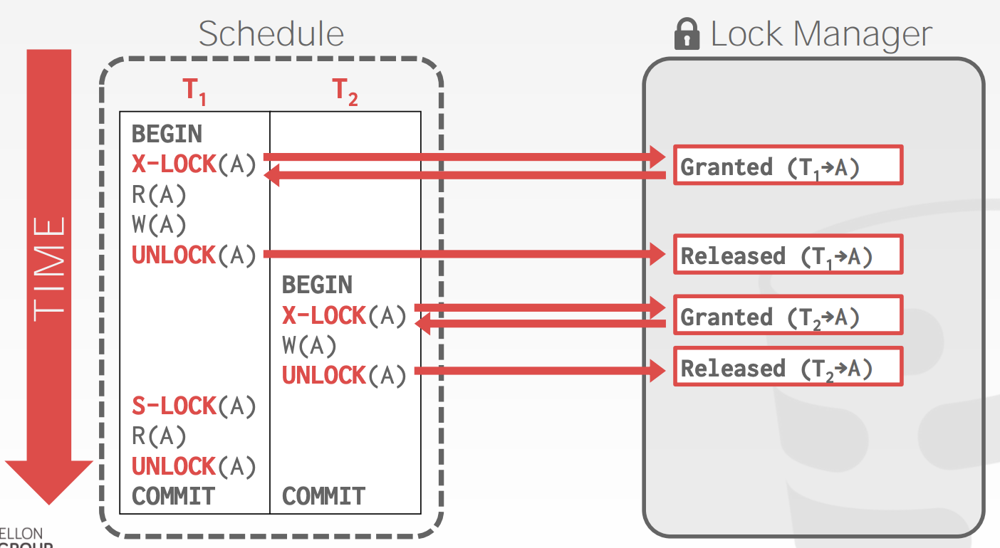
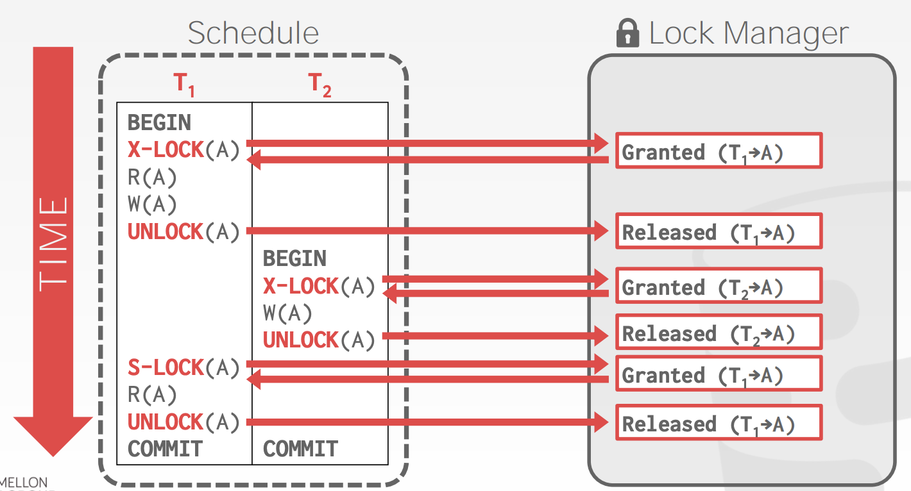

##### Example

We need a way to guarantee that all execution schedules are correct(i.e, serializable) without knowing the entire schedule adead of time.

Solution: Use locks to protect database objects.

##### Executing with locks

|                 | Locks                                | Latches                   |
| --------------- | ------------------------------------ | ------------------------- |
| **Separate...** | User transactions                    | Threads                   |
| **Protect...**  | Database Contents                    | In-Memory Data Structures |
| **During...**   | Entire Transactions                  | (关键的)ritical Sections  |
| **Modes...**    | Shared, Exclusive, Update, Intention | Read, Write               |
| Deadlock        | Detection & Resolution               | Avoidance(避免)           |
| **…by...**      | Waits-for, Timeout, Aborts           | Coding Discipline(准则)   |
| Kept in ...     | Lock Manager                         | Protected Data Structure  |

 (注：闩锁和锁定既有相同点又有不同点。相同点在于它们都是用于实现串行化的资源。而不同点则在于闩锁（Latch）是一个低级别、轻量级的锁，获得和释放的速度很快，以类似于信号灯的方式实现。而锁定（Lock）则可能持续的时间很长，通过使用队列，按照先进先出的方式实现。Latch是非入队的，而Lock是入队的。Latch不存在死锁，而Lock中存在)

**Basic Lock types**

- S-LOCK: Shared locks for reads
- X-LOCK: Exclusive locks for writes

**Executing with locks**

Transactions request locks(or upgrades).

Lock Manager grants or blocks requests.

Transactions release locks.

Lock manager updates its internal lock-table.

- It keeps track of what transactions hold what locks and what transactions are waiting to acquire any locks.

**Concurrency contorl protocol**

Two-phase locking(2PL) is a concurrency control protocol that determines whether a txn is allowed to access an object in the database on the fly.

The protocol does not need to know all of the queries that a txn will execute ahead of time.

**Two phase locking**

- Phase #1: Growing

Each txn requests the locks that it needs from the DBMS's lock manager.

The lock manager grants/denies lock requests.

- Phase #2: Shrinking 

The txn is allowed to only release locks that it previously acquired. It cannot acquire new locks.

The txn is not allowed to acquire/upgrade locks after the growing phase finishes.

The txn is not allowed to acquire/upgrade locks after the growing phase finishes.

**Executing with 2PL**

2PL on its own is sufficient to guarantee conflict serializability.

It generates schedules whose precedence(优先) graph is acyclic(非循环的).

**2PL Cascading aborts**

This is a permissible schedule in 2PL, but the DBMS has to also abort T2 when T1 aborts.

- Any information about T1 cannot be "leaked" to the outside world.

**Strict two-phase locking**

The txn is not allowed to acquire/upgrade locks after the growing phase finishes.

Allows only conflict serializable schedules, but it is often stronger than needed for some apps.

A schedule is strict if a value written by a txn is not read or overwritten by other tens until that txn finishes.

Advantages:

- Does not incur cascading aborts.
- Aborted txns can be undone by just restoring(恢复) original values of modified tuples.

**Example**

T1 - Move $100 from Andy's account(A) to his bookie's account(B).

T2 - Compute the total amount in all accounts and return it to the application.

- Non 2PL example

- 2PL example

- Strict 2PL example

- 2PL may lead to DeadLock

A deadlock is a cycle of transactions waiting for locks to be released by each other.

There is two ways of dealing with deadlocks
- 1.Deadlock Detection(检测)
- 2.Deadlock Prevention(预防)

**Deadlock Detection**

Model: The DBMS creates a waits-for graph to keep track of what locks each txn is waiting to aquire:
In follow Model
- Nodes are transactions
- Edge from T(i) to T(j) if T(i) is waiting for T(j) to release a lock.

The system will periodically check for cycles in waits-for graph and then make a decision on how to break it.

