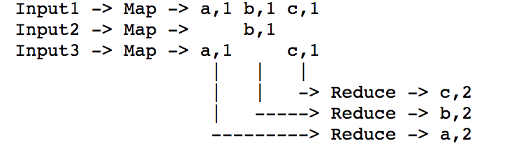
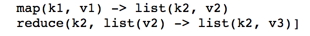

**不敢确认的翻译给出了原文，避免误解**

**什么是分布式系统**？

1.多台主机合作

2.DNS，P2P文件共享，存储大数据的数据库，MapReduce模型，大量基础设施都是分布式的

**为什么需要分布式**？

1.连接物理上分离的实体

2.通过隔离实现安全

3.通过副本来实现容错

4.通过并行CPU/mem/disk/net 来扩展系统的吞吐量

5.但是：

1) 分布式系统具有复杂性，包括很多并发的部分

2) 必须应对系统中部分部分失败

3) 很难实现性能潜力

**实验的目标**：

1.更加深入的了解一些重要技术

2.积累分布式系统的编程经验

**主话题**

1.这是一门关于基础设施的课程，这些分布式的基础设施架设起来以供应用使用

2.用来应用程序分布的复杂性

1）三大抽象

存储，交互，计算

2）实现分布式系统的一些基础知识

RPC，线程，并发控制

3）分布式系统的性能

**理想：可扩展的吞吐量**

可扩展的吞吐量-Nx的服务器数量，Nx的总吞吐量，通过CPU/Disk/Net并行实现

所以可以通过购买更多的服务器来处理更多的负载

**现实：扩展变得越来越困难**

负载均衡，(stragglers)性能落后的机器

很小的，不可以并行化的部分

隐藏共享资源，比如网络

分布式系统的容错性(fault tolerance)

1000个服务器，复杂的网络连接，总是会出现一些问题
我们想通过应用程序来隐藏(容忍)这些失败

可用性：尽管失败，我仍然可以继续使用我的文件

耐用性(Durability)：当故障机器得到修复时，我的数据可以被恢复

一个好主意：使用副本服务器(replicated servers)

如果一个服务宕机了，客户端可以选择使用其他的服务器

**分布式系统的一致性**

通用的基础架构需要明确定义的behavior，实现良好的behavior是困难的

1.客户端提交并行的操作
2.服务器在尴尬的时候崩溃
3.网络问题可能是服务器看起来像是死机了
4.脑裂的风险(split brain)

**一致性和性能是相对的**

1.一致性需要交互
2.具有令人满意("严格")语以的系统通常很慢
3.快速的系统通常可以使应用程序面对复杂的行为

案例学习: MapReduce

**MapReduce概述**

1.Context: 对多个TB的数据集进行多个小时的计算

例如：分析分布在1000多台计算机上的大量图结构的数据，如果不是分布式系统专家来开发是很痛苦的

2.模型目标：非专业程序员可以地在许多服务器上以合理的效率分割数据集并处理

3.程序员定义Map和Reduce函数的顺序代码，通常很简单

4.MapReduce在具有巨大输入的1000台服务器上运行函数并隐藏了分发处理的细节

**MapReduce的抽象视图**

输入(input)被分为M个文件

[maps 生成多行 K-V对，reduces合并列]

MR（MapReduce简称）为每个输入文件调用Map()，产生一组 k2, v2 的中间顺序，每个Map() 调用是一个任务。

MR为给定的k2收集所有中间v2，并将它们传递给Reduce调用最终输入设置为来自Reduce() 的 <k2, v3> 对，结果存储在R输出文件中

[MapReduce API]

**MapReduce隐藏了一些细节痛点**

1.在服务器上启动 s/w

2.跟踪哪些任务已经完成了

3.数据移动

4.任务失败后恢复

**Mapreduce 具有很好的扩展性**

1.用N台服务器可以获得Nx的吞吐量

假设 M和R >= N （即：很多的输入文件和map输出的key）

Maps()s可以并行的运行，因为它们之间没有交互，Reduce()s 也是同样的

唯一的交互是maps和reduces之间的 "shuffle"

2.因此，你可以通过购买更多的服务器来获得更多的吞吐量

而不是对每个应用程序做特殊，高效的并行化

**限制性能的因素是什么？**

1.我们关心这个因为这正是系统性能的优化点
CPU? 内存? 磁盘? 网络？

2.网络带宽的限制

网络的内部总容量，通常远小于主机之间网络链路的速度总和

难以建立一个比单台计算机运行速度快1000倍的网络

所以分布式系统的设计者关心的是最大限度的减少网络上的数据移动

**容灾处理**

如果有服务器在MR job过程中宕机怎么处理

隐藏失败是实现模型简易编程一个大的部分

为什么不从一开始就重启整个job

MR过程只会重新运行失败的Map()和Reduce()

它们是pure fuctions,不会修改它们的输入，不保存状态，它们之间不共享内存，没有map/map 或者 reduce/reduce 之间的交互，所以重新执行会有相同的输出结果

MR与其他的并行编程方案相比，pure fuctions是一个主要的限制，但这对MR编程模型的简单性至关重要

**更多的细节**

1.Master：给所有的worker分配任务，记住中间输出结果是M输入的分片

输入数据存在GFS中，每个分片存了3个副本

2.所有的计算机同时运行GFS和MR workers

3.输入分片数比workers数要多

4.Master在每个服务器上启动一个Map任务，当旧任务结束时，会接着处理新的任务

5.Worker对通过key做hash计算，将Map数据输出到R个分区中，存储在本地磁盘

直到所有Maps操作结束后才会进行Reduce计算

6.Master告诉Reducers从Map操作的workers那里获取中间数据分块

7.Reduce操作的workers将最终输出结果写到GFS中

**如何通过细节处的设计来提高网络性能**

1.Map的输入从本地磁盘读取，不是通过网络

2.生成的中间数据只在网络中传输一次，存储在磁盘中，而不是GFS

3.生成的中间数据分块保存很多的key，并存储在文件中

4.大块的网络传输效率更高

**如果更均衡的分配负载**

1.scaling out是至关重要的，否则使用Nx服务器就没有得到相应的收益

2.但是处理一个split或者partition的分区时间是不统一的，不同大小和内容，不同的服务器硬件

3.解决方案：split的数多于workes数

Master将新的splits分发给已经完成先前任务的workers

所以更快的服务器比慢速的服务器做更多的工作，并同时完成。

**MR如何应对worker崩溃呢**

1.Map worker 崩溃

master重新运行，通过其他GFS的副本作为输入

即使worker已经完成，因为我们仍需要磁盘上的中间数据

一些Reduce workers可能已经督过workers的中间数据

2.Master怎么知道worker崩溃了(通过 pings)

如果Reduces已经获取了所有Map操作生成的中间数据，那么master不再需要重新运行Map，然后Reduce崩溃必须等待Maps重新运行

3.如果 reduces worker在生成结果之前崩溃，那么master将重新启动另一个worker

4.Reduce worker在写输出的过程中崩溃

GFS具有 atomic rename ,可以防止输出在完成之前可见

5.所以master在其他的地方重新运行Reduce 任务是安全的

