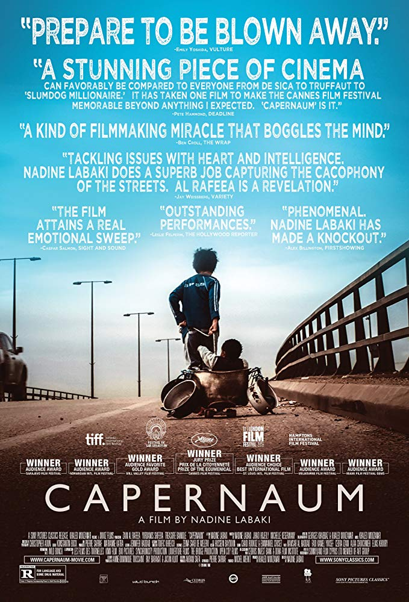

​	电影还没有在国内上映，就用特殊手段提前看了。确实是一部分好片，等电影上映到影院补上电影票。

​      《迦百农》是这样一部电影，一旦你看完它，你就想去帮助一个人，成为一个人，让人们生活的更好。卡百农是一部属于全世界的电影，它是如此的真实，把多个尺度，多个层次，多种感情展现的淋漓尽致，贯穿你的心灵。

​	

​	这部电影讲述了一个出生在贫困中的孩子，他有很多兄弟姐妹，他父母不工作，所以把他们所有的大兄弟姐妹派到街上去买果汁，搬煤气罐…任何能维持生计的东西，但这不应该是一个12岁的孩子应该承受的。父母甚至卖了他们11岁的女儿给房东当老婆，这样他们就可以过上更好的生活，小男孩拼命反抗却无能为力，最后他离家出走，逃离这令人绝望的原生家庭。离家路上，他有幸被非法移民拉希尔领养。虽然拉希尔同样贫困，还偷偷带了一个私生子尤纳斯，可她给予了扎因从未体会的家庭温暖。随着拉希尔被拘留，面临遣返，扎因失去了庇护所。扎因开始独自抚养尤纳斯，他拼尽全力，也无法终止悲剧的轮回。

​	这部电影的感情会把你切碎，让你想接触屏幕，去拥抱所有的孩子。

​	在现实生活中扮演扎恩的男孩子也叫扎恩，他的表演很有力量。很高兴查到一个消息，导演娜丁宣布了他的现状：

> 他目前获得了挪威的护照，已经被安置在那里三、四个月了。他有生以来第一次去上学。他正在学习如何读写。他重新获得了童年。他在花园里玩耍；他不再玩刀子和垃圾了。

​	可是在嫩巴黎还有无数个案例，那些孩子们，他们的现状呢？